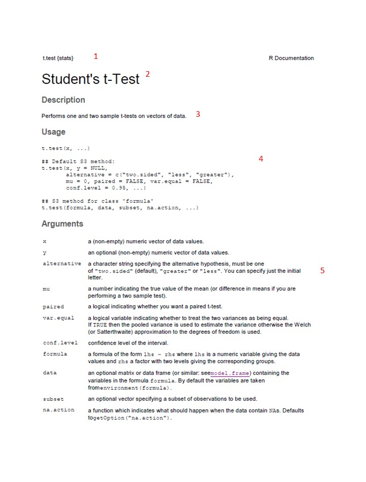

# Getting R help {#help}

The first place most people go for R help is the "Help" tab in the "Files/Plots/Packages/Help" pane on the console (described in Chapter \@ref(rstudio)). Here you can do a search by topic/term using the search window at the top right. You can also click the "house" icon to go to the home menu for the help files and use the table of contents there to navigate to what you are looking for.

## Using R help

The hardest part about R help files is that at first they don't seem that helpful, and to new R users, they seem to be written in code. However, all of the help pages are structured the same way, so once you learn how to de-code them, you'll be well on your way. Below is an example of how to interpret R help files

## R "Cheatsheets"

Because R is open source software, there is also a culture of open access help. Several R programmers have made helpful "Cheatsheets" that are worth printing off and hanging by your desk. Try [this one](https://cran.r-project.org/doc/contrib/Short-refcard.pdf) by Tom Short for starters.

## R books

As with the cheatsheets, there are open access books out there (as well as expensive ones to buy). For beginners, "The Pirates Guide to R" by Nathaniel D. Phillips is **HIGHLY** recommended. You can access it [here](https://bookdown.org/ndphillips/YaRrr/)

## How to interpret R help files

R documentation follows the following format. As an example, we'll use the screenshot below for a really simple statistical command (the t-test) to walk you through the R documentation. Numbers below correspond to the labels on the screenshot.

1.  **header** This simply gives the command for the thing you are trying to do, in R language

2.  **Title** This is a title of the function/command/tool in more plain language

3.  **Description** This section provides a short description of what the command does, written in reasonably plain language

4.  **Usage** This is where you see an example of R code that you use to execute the command (**TIP** you can tell what text in the help file is R code and what is other information by the font. Example code is in courier font). Any example prefaced with two hashtags ("\#\#") is a comment that adds additional description or provides different options for the comment. For example, for the t-test here, the first example is for the default method, where you are doing a t-test for a difference between two numeric vectors of data values ("x" and "y"). The second example is where you are applying the t-test to a formula instead of two numeric vectors. Until you start doing more advanced statistics, the default method will usually be what you use.

5.  **Arguments** This section breaks down every element in the R code under "Usage" above it and describes what the input is that you need to provide. It also gives you details about the options as well as what the defaults are. For example, for the t-test documentation here, it tells you that "x" is "a (non-empty) numeric vector of data values". It also tells you that this is what "y" is but note that it tells you that "y" is optional (i.e., you can do a t-test on just one vector of data values). This fact is also shown in the example code where it says "y = NULL".

Note that you often do not have to input ALL the arguments. If you are happy with the defaults you don't have to type in the code. For example, the description of the argument "alternative" tells you that you can specify whether the alternative hypothesis is two-sided (i.e., two-tailed), or one-tailed, in which case you have to say whether the alternative hypothesis is that the second set of data (e.g., the treatment) are greater or less than the first (e.g., the control). The default is that you are assuming the alternative hypothesis is two-sided. If this is what you want, then your code only needs to look like this

`t.test(x, y)`

However, if you want a one-sided test, and your alternate hypothesis is that the treatment (y) is greater than the control (x), then you need to type a bit more code, like this:

`t.test(x, y, alternative = c("greater"))`

6.  **Details** This section gives you a little more detail about what the function is doing. For more advanced functions, there may be details on the types of inputs allowed and other caveats. *This section is really helpful to read closely!*

7.  **Value** This section lists the objects (output) created when you execute the command. The relevance of this list will become more clear once you start using R.

8.  **See Also** This section is usually just links to similar commands to the one you are reading up on, or related to it somehow. These can be useful to explore when doing more complex statistical tests, or if you are not sure which test you should be using. Clicking the link will just take you to the Documentation page for that command, which will be set up exactly the same way as this one.

9.  **Examples** This gives sample code and output. If you have installed the necessary package(s) to run this code, you can just try the code out yourself by typing the code *exactly* as shown in the example in the Console window of RStudio. It will call data that comes built in with the package when you installed it and can be a helpful way for you to understand how the command is working before you try it with your own data.

```{r fig.align='center', echo=FALSE, message=FALSE, out.width="95%"}

```

```{r fig.align='center', echo=FALSE, message=FALSE, out.width="95%"}
knitr::include_graphics("./figures/HelpDoc_partB.jpg")
```

## Debugging

You are inevitably going to get error messages! Don't panic when you do! Debugging is part of using any coding language. Here are a few tips for debugging

1.  As a first step, check for spelling mistakes and typos. If you accidentally mis-spelled the name of the variable, vector or object you were specifying when you defined it (e.g., `leaf.legnth <- c(2,4,6,8)`) then if you spell it the way you MEANT to spell it when you apply a function to it. For example lets say I want to convert the leaf length vector into millimeters by multiplying it by 10 like this: `leaf.length.mm <- leaf.length*10` then I will get an error message because `R` is looking for something called `leaf.length` but I accidentally spelled it `leaf.legnth`.

-   You will know you have a spelling issue when you get an error that says `Error: object 'XXXX' not found` where xxxx is the name of the thing you mis-spelled.

-   Related to spelling errors is accidentally putting in a period instead of a comma, or missing a parentheses.

2.  A second common error is input the wrong data type to a function. For example, if I create a vector of character data for leaf type, and a vector of leaf lengths (spelling correctly this time!), and then apply a t-test, I will get an error message because I cannot do a t-test with character data. However, the error message will not clearly state that. See code snippet below.

<!-- -->

    leaf.length <- c(2.0, 2.1, 2.4, 2.2, 2.1)
    leaf.type <- c("simple", "compound", "lobed", "toothed", "palmate")
    t.test(leaf.length, leaf.type)

This will give an error message.

**TRY IT:** type the code above in the console and see what the error message is.

`Error in if (stderr < 10 * .Machine$double.eps * max(abs(mx), abs(my))) stop("data are essentially constant") :    missing value where TRUE/FALSE needed In addition: Warning messages: 1: In mean.default(y) : argument is not numeric or logical: returning NA 2: In var(y) : NAs introduced by coercion`

*More tips*

Learning to de-bug takes practice! If your error isn't due to one of the two reasons above, then the next step is to try running the code line-by-line to figure out where the error is.

A good idea is to use Google or the `R` documentation files to find an example of code that is doing the same thing you want to do. Cut and paste it in as an example, and then modify it with your inputs.

You can also try to type the exact text of the error message into Google, but this isn't always the most useful approach.
