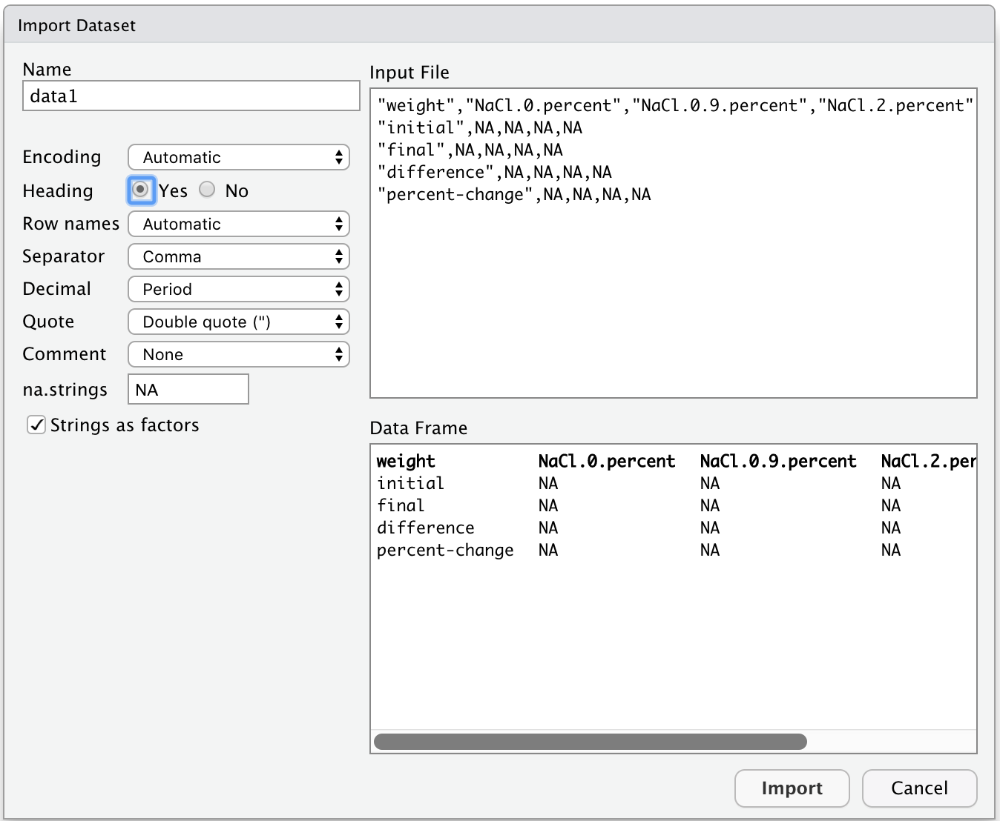

# Entering and loading data {#data-entry}

## Entering data

Good data organization is the foundation of any research project, 
and this begins with entering and archiving data. More detail on the practice of good data entry and documentation can be found in Chapter \@ref(data). This chapter focuses on the "how to" of data entry in R.

There are several reasonable options for data entry, for example:

1. Spreadsheet
2. Text file
3. Database
4. Form (web or GUI databases). 

In R, you can also input data directly, which can be the right choice if you are working with a small dataset. 
Here, you will learn how to enter the data from your experiments
and save them using R. 

Let's start by
making Table 1 for your report, which we will call 
`solution-concentration-effect-on-potato.csv`:

```{r}
table1 <- data.frame(weight = c("initial", "final", 
                                "difference", "percent-change"), 
                     "NaCl-0-percent" = c(NA, NA, NA, NA), 
                     "NaCl-0.9-percent" = c(NA, NA, NA, NA), 
                     "NaCl-2-percent" = c(NA, NA, NA, NA), 
                     "NaCl-5-percent" = c(NA, NA, NA, NA))
write.csv(x = table1, file = "solution-concentration-effect-on-potato.csv", 
          row.names = FALSE)
```

In the above code, make sure to replace the `NA`'s with the values from your experiment. 
Keep in mind that the values entered into the tables should be 
decimals greater than or equal to zero, and likely less than
100 since you measured mass in grams and the potato
cubes for the experiments were 8 cm^3^ in size. 

Notice that we used the file extension ".csv".
CSV stands for comma-separated values, which is a format for 
tabular data stored in a text file where a comma separates the columns of the data. 
That is why a comma separates each of the values in the rows for the different solutions. 

Now, we will make Table 2, which includes the class averages and we will call 
`solution-concentration-effect-on-potato-averages.csv`:

```{r}
table2 <- data.frame(weight = c("percent-change", "minimum-value", 
                                "maximum-value", "difference"), 
                     "NaCl-0-percent" = c(NA, NA, NA, NA), 
                     "NaCl-0.9-percent" = c(NA, NA, NA, NA), 
                     "NaCl-2-percent" = c(NA, NA, NA, NA), 
                     "NaCl-5-percent" = c(NA, NA, NA, NA))
write.csv(x = table1, file = "solution-concentration-effect-on-potato-averages.csv", 
          row.names = FALSE)
```


You might have just done this in Excel. We did not teach this method because Excel is not recommended for data entry. There are compatability issues between ```Excel``` and ```R``` that create problems. Spreadsheet software like Excel can be handy for data entry, but you should think carefully about how to organize your rows and columns first (see Chapter \@ref(data) for details). If you do have data in Excel, you should convert it to a .csv (comma delimited format) first, before you import to ```R```.

Here are two articles that do a nice job discussing the differences and pros/cons of Excel vs. ```R```

[Excel v R](https://www.jessesadler.com/post/excel-vs-r/): read the first section only

[Understanding R programming over Excel](https://www.gapintelligence.com/blog/understanding-r-programming-over-excel-for-data-analysis/)


## Loading or importing data

We will look at two ways of importing data into R, via a command or using the import feature.
Both options are equivalent; and when they are sucsesfull you will see your data as
a new object in the Environment tab (in the Environment/History pane).

### The programmatic way (i.e., command line) {#programmatic}

We can load our our data files in CSV format into R using the function `read.csv` in the following way:

```{r}
data1 <- read.csv(file = "solution-concentration-effect-on-potato.csv")
data2 <- read.csv(file = "solution-concentration-effect-on-potato-averages.csv")
```

Here, the argument `file =` of `read.csv` is the name of the file we want to read.
Notice that the filename needs to be a character string, so we put it in quotes.


### The RStudio way (the "import" feature)

In RStudio, click on the Environment tab. 
Then, click on `Import Dataset` and select `From Text (base)`. 

```{r import-feature, fig.cap="Using the Import Dataset feature.", fig.align='center', out.width="80%", fig.show='hold', echo=FALSE}
knitr::include_graphics('./figures/import-feature.png')
```

This feature will open a file browser where you can locate the `.csv` file,
in our case, for Table 1, it is called `solution-concentration-effect-on-potato.csv`.
Once you have selected the file click `Open`. 
A dialog for importing the file will open up:
on the left you can set the options on the import; 
on the top right you can see `Input File`, which is how the file looks like;
on the bottom right you can see `Data Frame`, 
which is a preview of how the file or data will look like in R.
In the `Name` field, write `data1` to rename the dataset.
Set `Heading` to `Yes`, this will 
tell R to read and include the first row of the file as the names of the columns - 
This is an important step! 
You will see that the column names appear in bold in the `Data Frame` box.
When you are ready click `Import`.

```{r import-dialog, fig.cap="Dataset import options.", fig.align='center', out.width="70%", fig.show='hold', echo=FALSE}

```

RStudio will now run the R code that imports your dataset. 
It will be similar to the command used in Section \@ref(programmatic).

## Inspecting the data

To take a look at our dataset, we can print it by typing the name in the Console and hitting `Enter` (or `Return`).

```{r}
data1
data2
```

You can also open the dataset by clicking on the object `data1` in the Environment tab. 
This will open a new tab with the dataset, instead of printing it into the Console,
which is a good choice if your dataset is larger.
Another option is to open the dataset using Microsoft Excel from your computer file browser.
