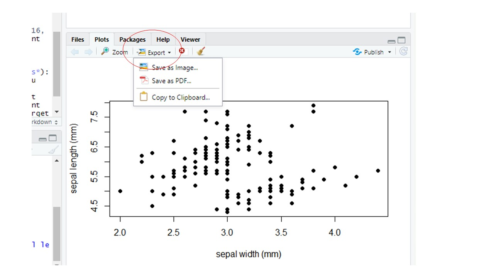
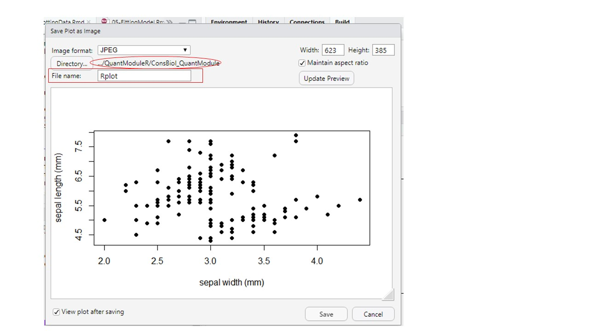

# Making graphs in R {#graph}

## Making graphs in R

You might have had experience making graphs using `Microsoft Excel`, however, making graphs with `Excel` is not recommended. A number of reasons to choose `R` over `Excel` are given in Chapter \@ref(intro). In addition, the defaults in `Excel` do not meet standards for good scientific graphs and you do not have the option to learn more sophisticated graphs after you master the basics, as the range of options available in `Excel` is limited.

You can make very attractive, clean, professional graphs and figures in `R`. This chapter is a basic introduction to `plot()` functions in `R`. More advanced users can use the package `ggplot2`. There are many good reference manuals for making sophisticated graphs [e.g. @abedin2014r; @murrell2018r].

## Scatter plots with `plot(x,y)`

In `R`, `plot()` is a built-in function: you do not need to install a package to call it. There are two mandatory arguments `x` and `y`, which are vectors that must have the same length. For example,

```{r}
x <- c(2, 4, 6, 8, 10)
y <- c(10, 20, 30, 40, 50)
```

Copy and paste the above code into your `Console` and type `Enter/Return`. Note that to make a vector we need to use `c()`. Now, query the value of `x` by typing `x` into your `Console`

```{r}
x
```

This lets us know that `x` is a vector that is a list of 5 numbers.

The command `plot(x, y)` will mark points on the graph by taking elements in the same position in the `x` and `y` vectors. For example, in the first position of the `x` and `y` vectors are `2` and `10`, respectively. Because `plot(x, y)` has `x` as its first argument, the values of `x` will correspond to the horizontal axis of the plot. Therefore, the first element of the lists `x` and `y`, will be reflected in the plot as a point marked at the `2` position of the horizontal axis and the `10` position on the vertical axis.

As the vectors `x` and `y` in our example are a list of 5 numbers, our graph will consist of 5 points, generated by pairing values in the `x` and `y` vectors in the same position:

```{r}
plot(x, y)
```

**TRY IT!** Copy and paste the above code into your `Console` or into a new script and run it. If `x` and `y` do not have the same lengths, the `plot()` function will give an error. **Try it!** Take the code below by copy and pasting it into your console:

```{r, error=TRUE}
x <- c(2)
y <- c(10, 20, 30, 40, 50)
plot(x, y)
```

Note the error message that is generated so that if you get this error later when coding on your own you might remember that this error is generated because `x` and `y` have different lengths.

Now try this code:

```{r}
x <- c(2, 2, 2, 2, 2)
y <- c(10, 20, 30, 40, 50)
plot(x, y)
length(x)
length(y)
```

Note we can use `length()` to query the length of `x` and `y`. In addition, the names `x` and `y` are the users choice. A nearly identical plot is generated with the code:

```{r}
A <- c(2, 2, 2, 2, 2)
B <- c(10, 20, 30, 40, 50)
plot(A, B)
```

The key is the internal consistency: `A` and `B` are the names of the vectors and these same names appear as the arguments of `plot(A, B)`. Can you guess what happens if you try `plot(B, A)` or `plot(A, A)`? Type these into your `Console` and give it a try.

------------------------------------------------------------------------

**EXERCISE 10.1**

1.  Which two vectors below will generate a plot if executed before `plot(a, b)`?

```{r}
a <- c(1, 3, 5)
a <- c(2, 4, 5, 6, 7)
b <- c(2, 2, 4, 6)
b <- c(2, 4, 6)
```

2.  A friend has written the code below, but it will not run. What do you think the problem could be?

```{=html}
<!-- -->
```
    a <- c(1, 2, 3)
    b <- c(2, 4, 6)
    plot(x, y)

------------------------------------------------------------------------

## Adding axes labels and changing symbols {#axes}

Note that all of the figures we have made so far are not great: none meet the standards of a good figure. What's missing?

-   meaningful `x` and `y` axis labels,
-   maybe it's more appropriate to show this data connected with a line, and
-   maybe you want the symbols to be a different shape or colour.

In addition, to the two manadatory arguments `x` and `y`, the `plot()` function has other optional argument that can be called to make a better figure. Try using the `help()` to learn about more options to change the look of your plot (refer to Chapter \@ref(help), *Getting help in R*, to recall how to display and read help files):

```{r}
help(plot)
```

You'll see there are a lot of optional arguments. First, let's fix the axis labels.

```{r}
x <- c(2, 4, 6, 8, 10)
y <- c(10, 20, 30, 40, 50)
plot(x,y, xlab = "temperature (degrees C)", ylab = "growth rate (cm)")
```

This one is a little better.

**TRY IT!** Copy and paste the above code into your `Console` to make sure you can make the graph with axes labels.

If you want to change the symbols, you use the `pch` argument to change the style (see Section \@ref(pch)). Note, that `pch = 17` corresponds to filled triangles, so let's make the graph, but with filled triangles.

```{r}
plot(x,y, pch = 17, xlab = "temperature (degrees C)", ylab = "growth rate (cm)")
```

Note that the order of the optional arguments is unimportant (the function arguments are separated by `,`) particularly where arguments are labelled with `xlab =` or `ylab =`. Lets try to see if we can put the arguments out of order and end up with the wrong graph:

```{r}
plot(pch = 17, ylab = "growth rate (cm)", xlab = "temperature (degrees C)", y, x)
```

In the above graph, we wanted `"growth rate (cm)"` and the vertical axis and this has appeared correctly, but the values of growth rate should be `c(10, 20, 30, 40, 50)` and now we see the values of `y` have appeared on the horizontal axes rather than on the vertical axis where they should be. This is because `y` appears before `x` in the plot command and whichever vector appears first will be read as corresponding to the values on the horizontal axis. On the other hand `"ylab ="` appears before `"xlab ="` but this does not cause a problem because `"ylab ="` still appears on the vertical axis as it should.

### Getting a bit more sophisticated

It's not hard to get more sophisticated with R graphics. The best approach is to explore one of the reference books listed to figure out how to do what you want to do.

One thing most undergrads will probably need or want to do is to visualize two sets of data on the same graph. For example, the goldfish data in [Appendix VI]("NEED TO ADD THE LINK") of the BIOL 1001 lab manual shows the opercular beats of two fish in response to temperature. It would be logical to show both fish on the same graph, but with different symbols. Here's how you would do it:

```{r}
temp <- c(5, 8, 12, 16, 20, 23)
```

This creates the vector of data for the x-axis.

```{r}
fishA <- c(36, 42, 59, 73, 88, 96)
```

This creates the vector of data for `Fish A`.

```{r}
fishB <- c(40, 49, 61, 71, 82, 90)
```

This creates the vector of data for `fish B`.

First, we plot `x` and `y` with the `temp` vector as `x`, and the `fishA` vector as `y`

```{r}
plot(temp, fishA, pch = 17, xlab = "temperature (degrees C)", ylab = "opercular beats (bpm)")
```

Then, to add a second vector of data (`fishB`) to the same plot, we use:

```{r}
plot(temp, fishA, pch = 17, xlab = "temperature (degrees C)", ylab = "opercular beats (bpm)")
points(temp, fishB, pch = 19, col = "dimgray")
```

*Caption: Opercular beats of two goldfish over increasing temperature. Triangle symbols represent fish A and dots represent fish B*.

Voila!

Note that `points()` can only be used after `plot()` as the `points()` function only adds data points to an existing plot, it does not create a plot on its own.
You can describe what the two symbols represent in the caption. For most scientific journals it is preferred to describe the symbology in the caption, rather than use a legend. However, with more complex graphs, or for some publications, you may wish to include a legend. Legends can be a bit tricky to work with in R - we'll leave those for a more advanced course.

**EXERCISE 10.2**

Re-create the graph above on your own, but this time, make the symbol for `fishA` an open square and the symbol for `fishB` a filled circle (see section \@ref(pch)). Export this plot and hand it in with your assignment (either as a .pdf file, or by pasting the .pdf file into an MS Word document or other text editor, see section \@ref(export)).

## Line graphs

Finally, if you wanted to have a line joining the points, you'd specify the `type = "l"` in the arguments of the plot function (`l` is for line, `p` is for points, and `b` is for both).

```{r}
plot(temp, fishA, pch = 17, type = "l", xlab = "temperature (degrees C)", ylab = "opercular beats (bpm)")
```

**EXERCISE 10.3**

Re-create the graph above on your own, but this time, also add a line for `fishB` which
joins the points as is shown above for `fishA`. Just as in section \@ref(axes), where we used the `points()` function to an existing plot, we can use the `lines()` function to add a line to an existing plot. To select the line type, use `lty = 2` (or another value), just as you would use `pch` in the `points()` function. Export this plot and hand it in with your assignment (by pasting the .pdf file into an MS Word document or other text editor, see section \@ref(export)).

## Boxplot

At some point in your data exploration and analysis you might want to explore the relationships between a continuous variable and various categorical groups. Boxplots are a common type of graph that allow you to do this. You are likely to meet this in your ecology class because we often need to compare values between different categories.


To demonstrate how boxplot is done in `R`, we will use a built-in `R` dataset called `PlantGrowth`.

The `PlantGrowth` dataset has 30 rows and two columns namely, `weight` and `group`. The `weight` column represents the dry biomass of each plant in grams, while the `group` column describes the experimental treatment that was given to each plant.

We will first load the data using the code:

```{r}
data(PlantGrowth)
```

We would like to view the first 10 rows of the data. We can do this using the `head()` function. We specify the number of rows as a second argument to the `head()` function. If you do not specify the number of rows, `R` will display the first six rows. 
```{r}
head(PlantGrowth, 10)
```

We can also view the last six rows of the data. We can do this using the `tail()` function. Here, we do not specify the number of rows. 
```{r}
tail(PlantGrowth)
```

Now we want to compare the weight of plants among the different treatments. The graph that is most appropriate to use is the boxplot hence, we will do this comparison by creating a boxplot. To create a boxplot, we need a continuous variable and a categorical variable. By inspecting the `PlantGrowth` dataset, we see that `weight` is a continuous variable and `group` is a categorical variable. Note that we can use `levels()` function to look at the levels of the `group` column. Try this in the `console`

```{r}
levels(PlantGrowth$group)
```

We will plot `weight` as a function of `group` (y as a function of x) using the `boxplot()` function. Notice how we write `weight` as a function of `group` (`weight ~ group`).
```{r}
boxplot(weight ~ group, data = PlantGrowth)
```

We can modify the axes labels just like we did in [section 9.3](https://ahurford.github.io/quant-guide-all-courses/graph.html#axes) by using the `xlab` and `ylab` arguments in the `boxplot()` function

```{r}
boxplot(weight ~ group, data = PlantGrowth, xlab = "Treatment Group", ylab = "Dried Biomass Weight (g)")
```

We have already learnt about how the `plot()` function is used to graph a scatterplot in [section9.4](https://ahurford.github.io/quant-guide-all-courses/graph.html#scatter-plots-with-plotxy). One other thing that you need to know about the `plot()` function is that if the `x` axis is a categorical variable, the function will recognize that and will graph a `boxplot`  instead of a scatterplot. Let us demonstrate this concept with the code that follows:

```{r}
plot(PlantGrowth$group, PlantGrowth$weight)
```

We can also graph the boxplot by using the code `plot(x2)` rather than `plot(x,y)` provided `x2` is a data frame with two columns where the first column is a categorical variable and the second column is a continuous variable. Let us demonstrate this with the `PlantGrowth` dataset. 
 
The `PlantGrowth` dataset has only two columns but we will have to rearrange the positions of the columns such that the `group` column which is the treatments (or categorical variable) becomes the first column and the `weight` column which is continuous becomes the second column.

```{r}
PlantGrowth <- data.frame(group=PlantGrowth$group, weight=PlantGrowth$weight)
head(PlantGrowth)
```
Now we can graph a boxplot using the `plot()` function with only one argument. For example `plot(x2)` where `x2` is the name of the dataframe. In this case `x2` is `PlantGrowth`.

```{r}
plot(PlantGrowth)
```

Note that in handling a dataframe which has more than two columns, you would basically have to extract the columns of interest and put them into a dataframe and apply the concept that has been studied in this section. 


## Other useful plot functions

The generic `plot()` function makes a scatter plot, with variations.

For other types of plots, R has different functions, but all have similar arguments for adjusting the labels, spacing, tic marks, symbols, etc.

See the following:

-   `barplot` to make bar graphs,
-   `boxplot` to make boxplots (refer to the previous section),
-   `hist` to make a histogram.

## Exporting your graphs {#export}

Once you've got plots in the "plot" window that you like, you can export them using them so that you can insert them into things like a word document, a power point file or a website. Click on the down arrow on the "Export" button in the Plots pane in RStudio, then select either to save as an Image or as a PDF. In the "Image" option you can choose various file formats (JPEG, TIFF, PNG, etc.).

```{r panes2, fig.cap="Export button in the Plots Window", fig.align='center', out.width="70%", fig.show='hold', echo=FALSE}

```

Be sure to check that you have the correct file path (circled in the figure below) and then give your figure a file name that makes sense (see rectangle in the figure below).

```{r panes3, fig.cap="Setting file path (oval - click the Directory button to change the file path) and file name for your exported figure", fig.align='center', out.width="70%", fig.show='hold', echo=FALSE}

```

## pch cheatsheet {#pch}

As it is hard to remember that `pch = 17` corresponds to filled triangles you can make a little cheat sheet for `pch` codes using the code below. You may want to print out a chart of the `pch` codes and tape it up on your wall by your computer, or in the front of your notebook as a handy reference.

```{r}
#++++++++++++++++++++++++++++++++++++++++++++
#generate a plot of point shapes which R knows about.
#++++++++++++++++++++++++++++++++++++++++++++
generateRPointShapes<-function(){
  oldPar<-par()
  par(font=2, mar=c(0.5,0,0,0))
  y=rev(c(rep(1,6),rep(2,5), rep(3,5), rep(4,5), rep(5,5)))
  x=c(rep(1:5,5),6)
  plot(x, y, pch = 0:25, cex=1.5, ylim=c(1,5.5), xlim=c(1,6.5), 
       axes=FALSE, xlab="", ylab="", bg="blue")
  text(x, y, labels=0:25, pos=3)
  par(mar=oldPar$mar,font=oldPar$font )
}
generateRPointShapes()
```
