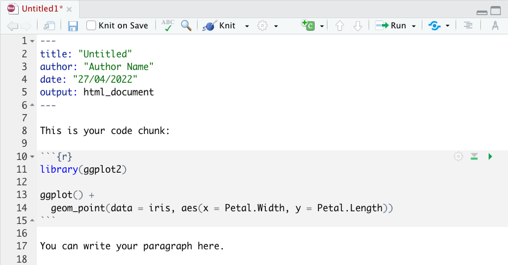
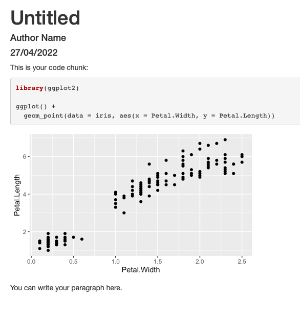

# R markdown {#rmarkdown}

## Introduction

R Markdown provides a fully reproducible framework for presenting and sharing data science. You can use a single R Markdown file to both:

* save and execute code
* generate high quality written documents

R Markdown documents can be rendered to many output formats including HTML documents, PDFs, Word files, slideshows, etc.

### Installation

You can install the [R Markdown](https://rmarkdown.rstudio.com) package from CRAN:

```{r, eval = F}
install.packages("rmarkdown")
```

## Setup

To get started, open a new plain text file and save it with the extension .Rmd. Alternatively, if you are using RStudio, you can create a new Rmd file from the menu File -> New File -> R Markdown.

An R Markdown file contains three types of content:

1. An optional header that contains the document metadata and is surrounded by --- on either side.

2. Chunks of R code surrounded by ```.

3. Text 


```{r, fig.cap="R Markdown general setup", fig.align='center', out.width="70%", fig.show='hold', echo=FALSE}

```

```{r, fig.cap="R Markdown output preview", fig.align='center', out.width="70%", fig.show='hold', echo=FALSE}

```

The optional header is written using [YAML](https://yaml.org) programming language. 
Note when you 

When you open an .Rmd, you get a notebook interface where code and output are interleaved. You can run each code chunk by clicking the Run icon (it looks like a play button at the top of the chunk), or by pressing Cmd/Ctrl + Shift + Enter. RStudio executes the code and displays the results inline with the code:

Tip: Try to leave at least one empty line between adjacent elements, e.g., between a header and a paragraph or between text and code, to ensure everything renders properly.

## Syntax

### Headers

Section headers can be written after a number of pound signs, e.g.,

```{r}
# First-level header

## Second-level header

### Third-level header

```

If you do not want a certain heading to be numbered, you can add {-} or {.unnumbered} after the heading, e.g.,

```{r}
# Preface {-}
```

### Lists

Unordered list items start with *, -, or +, and you can nest one list within another list by indenting the sub-list, e.g.,

```
- one item
- one item
- one item
    - one more item
    - one more item
    - one more item

```

The output is:

- one item
- one item
- one item
  - one more item
  - one more item
  - one more item

Ordered list items start with numbers (you can also nest lists within lists), e.g.,
```
1. the first item
2. the second item
3. the third item
    - one unordered item
    - one unordered item
```

The output does not look too much different with the Markdown source:

1. the first item
2. the second item
3. the third item
  - one unordered item
  - one unordered item
