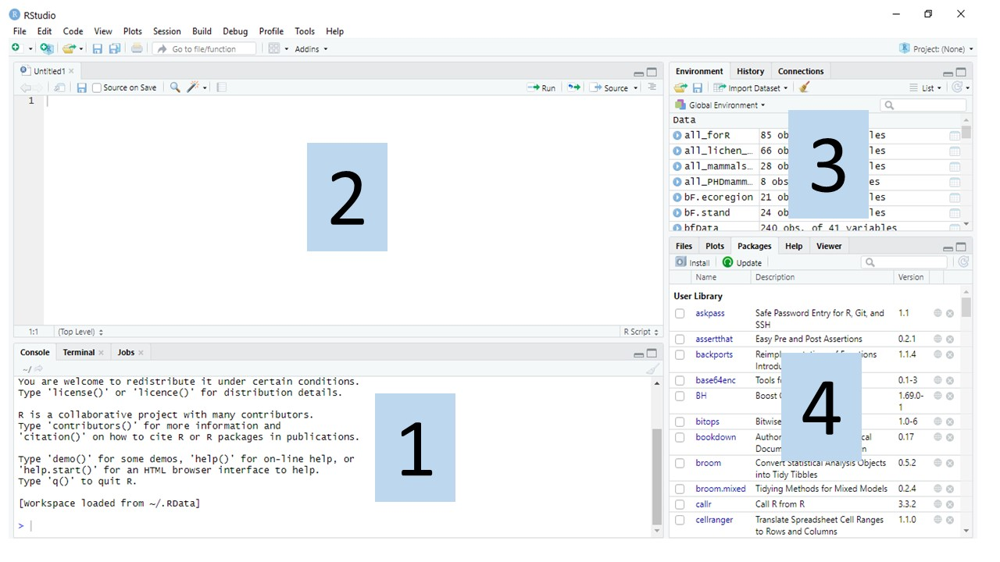
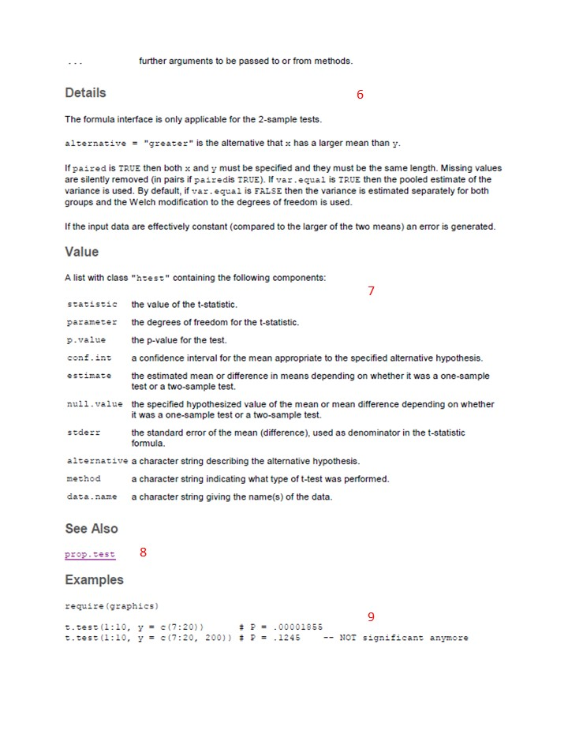
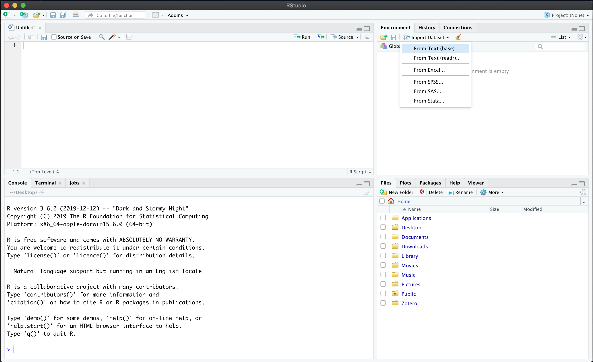
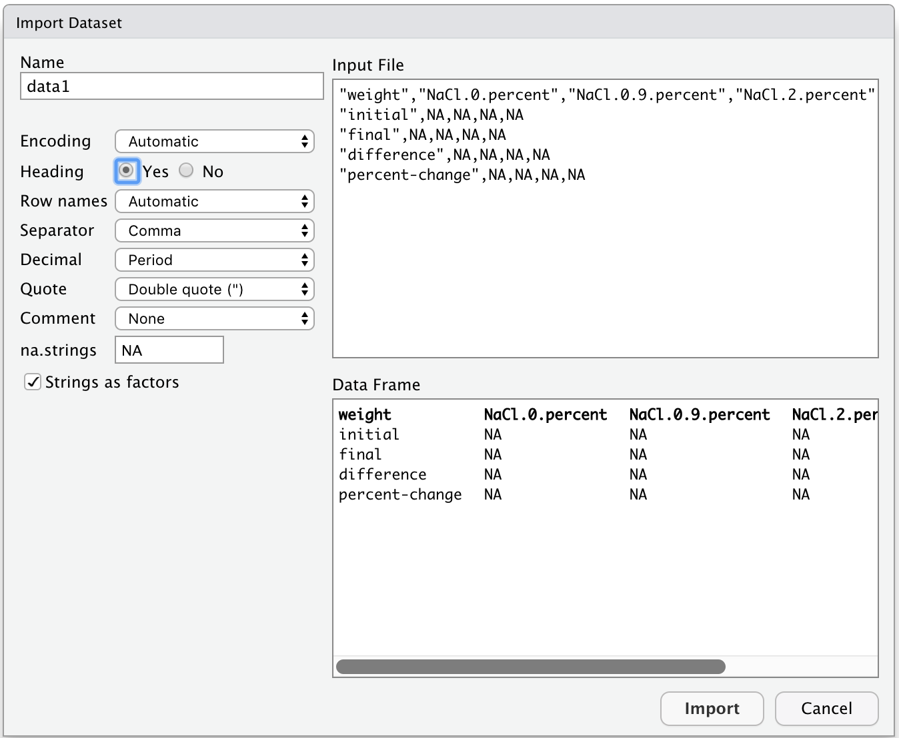

--- 
title: "Quantitative skills for biology"
site: bookdown::bookdown_site
output: bookdown::gitbook #bookdown::html_document2
documentclass: book
bibliography: [references.bib]
biblio-style: apalike
link-citations: false 
github-repo: ahurford/quantitative-training-guide
description: "Quantitative skills for biology"
---

# Overview {#intro}

Many biology-relevant skills are now performed using computers: statistical analyses, mathematical modelling, managing and reformatting data, visualizing data, identifying genes from DNA sequences, constructing 3D models of proteins, and making phylogenies. Quantitative skills and best practices in data science are now being incorporated throughout the biology major.

Teaching quantitative skills is necessary since a survey reported that more than 90% of ecologists found that, in retrospect, their training in statistics and mathematics, during their undergraduate biology major, was too low [@barraquand2014lack]. This same study found that practicing ecologists recommended that 30% of coursework during a biology major be dedicated to quantitative training.

Today's biologists use various software, particularly Microsoft Office, R, Python, and ArcGIS. An advantage of scripting languages such as R, rather than _point and click_ languages, such as _Microsoft Excel_, is that analyses are reproducible because the sequence of commands are saved in a file. When graphs are produced by clicking various buttons in a software, these steps are not recorded: errors maybe difficult to identify, and the steps may be forgotten.

This quantitative training manual teaches data manipulation and visualization in R. Our choice of R is for the following reasons:

1. A valued skill: As of March 2019, R is the [fifth ranked software](http://r4stats.com/articles/popularity/) listed in job advertisements for Data Scientists. Python is the number one ranked software, but R is a popular statistical software and is widespread in biology due to the need to analyze the results of experiments using statistics.

1. Reproducibility: R is a scripting software, so unlike _point and click_ softwares, the steps to produce a data analysis or figure are fully reproducible.

1. Accessibility: R is free, unlike many statistical software packages that are quite expensive. This means that researchers or organizations, such as environmental NGOs, can still do sophisticated analysis with limited budgets. 

1. No limits: R has a large user community, and contributed packages allow you to do almost anything. R packages range from [serious](https://rviews.rstudio.com/2017/10/09/population-modeling-in-r/) to [fun](https://www.r-bloggers.com/useless-but-fun-r-packages/)).

1. Popularity: A survey of studies from 30 ecology journals found that in 2017, 58% of articles used R as the primary tool to generate their results [@lai2019evaluating].

The quantitative training program at MUNL was launched in BIOL 1001 in [Spring 2020](https://gazette.mun.ca/teaching-and-learning/culture-change/) during the COVID-19 pandemic.


## Course links

[BIOL 1001 - Principles of Biology](https://ahurford.github.io/BIOL-1001/index.html)

[BIOL 1002 - Principles of Biology](https://ahurford.github.io/biol-1002/)

[BIOL 2010 - Botany](https://ahurford.github.io/walkThroughWoodsGuide/)

[BIOL 2600 - Ecology (in progress)](https://ahurford.github.io/biol_2600_bookdown/)

[BIOL 3295 - Population and Evolutionary Ecology](https://ahurford.github.io/BIOL-3295-Fall-2020/)

BIOL 4505 - Systematics and Biogeography

BIOL 4606 - Bioinformatics: Biological Data Analysis 

BIOL 4607 - Models in Biology

[BIOL 4605/7220 -  Quantitative Methods in Biology: RIntro](https://www.mun.ca/biology/schneider/b4605/StatProg/Rintro/); [Toolbox for labs](https://www.mun.ca/biology/schneider/b4605/StatProg/Rcode.pdf)

BIOL 4630 - Mammalogy

[BIOL 4650 - Conservation](https://ahurford.github.io/BIOL4650-marine_conservation/)

[BIOL 4651 - Conservation: (GIS Module)](https://nlboreal.github.io/ConservationGIS/); [(Quantitative Methods Module)](https://nlboreal.github.io/ConsBiolQuantFun/)

## Instructor guide
If you are a biology instructor who is interested in furthering quantitative training in your course you can download a guide [here](https://github.com/ahurford/quant-guide-all-courses/blob/master/files/Instructor_Guide.pdf) (please download the file as viewing it does not display all the information).

<!--chapter:end:index.Rmd-->

# **PART I: INTRODUCTION** {-}

# R and R Studio {#install}

R is a programming language for statistical computation and graphics. A user-friendly way to use R is through RStudio. RStudio is a Graphical User Interface (GUI) that facilitates R coding by providing buttons and menus for commonly used commands.

A simple way of understanding the difference between R and RStudio is thinking of R like a car's engine while RStudio is like a car's dashboard, as depicted in Figure \@ref(fig:R-vs-RStudio-1). In the same way as having access to instrumentation, gauges, controls, and a navigation system makes driving more comfortable, using RStudio's interface makes using R easier [@ismay2019statistical]. Similarly, R can be used without RStudio, but RStudio cannot be used without R.

**In this guide, we recommend and assume that you are using R via RStudio.**

```{r R-vs-RStudio-1, echo=FALSE, fig.align="center", fig.cap="Analogy of the difference between R and RStudio [@ismay2019statistical].", out.width="95%", purl=FALSE}
knitr::include_graphics("figures/R_vs_RStudio_1.png")
```

## Installing R and RStudio {#installing}

Since RStudio is an add-on to R, you must first download and install R and then download and install RStudio. Follow these instructions in order:

1.  Download and install R from <https://cloud.r-project.org/>:

    -   If you are a Windows user: Click on "Download R for Windows", then click on "base", then click on the link "Download R X.X.X for Windows".
    -   If you are macOS user: Click on "Download R for (Mac) OS X", then look for "Latest release:" and click on the link to the left of the first paragraph "R-X.X.X.pkg",
    -   If you are a Linux user: Click on "Download R for Linux", choose your distribution and then your Linux version to find the installer for your setup.
    -   **NOTE: The X's in the links above stand for the version number, which may be different for you depending on the date when you download the files.**

2.  Download and install RStudio from <https://rstudio.com/products/rstudio/download/#download>.

    -   Under "All Installers" find your computer's operating system (OS).
    -   Click on the corresponding download link.

### RStudio Cloud {#rcloud}

If you prefer not installing additional software on your computer or are experiencing issues during the installation, we recommend using RStudio Cloud as an alternative. These are the steps that you have to follow:

-   In a web browser, go to <https://rstudio.cloud/plans/free>.
-   Sign up for the "Cloud Free" plan, then log in.
-   You will be directed to a virtual dashboard called "Your Workspace". Here, click on "New Project" to start working on a blank project.
-   After a few seconds, you will see the RStudio console load in your browser. You can use this interface as you would use RStudio on your computer.
-   Keep in mind that this is a web-based app; therefore, it may take a few minutes to load, and it could also slow down the browser's speed. Both are normal; try to be patient. We are not doing intense calculations for the labs, so it will not take that long.

## Using R via RStudio

Now that you have installed R and RStudio on your computer, you will see that you have both new programs. We will always work in RStudio and not in the R application, as shown in Figure \@ref(fig:R-vs-RStudio-2).

```{r R-vs-RStudio-2, echo=FALSE, fig.align="center", fig.cap="Icons of R and RStudio on your computer [@ismay2019statistical]. Remember to always click on RStudio!", out.width="90%", purl=FALSE}
knitr::include_graphics("figures/R_vs_RStudio.png")
```

<!--chapter:end:03-installing-R.Rmd-->

# Finding your way around RStudio {#rstudio}

RStudio has 4 windows (also known as "panes") that are inter-linked. The default layout is shown in Figure \@ref(fig:panes). The first time you open `RStudio` you may not see the top left pane (the Source pane, labeled 2 in the figure below). To make it visible, use your mouse to select `File -> New File -> R Script`. You can move the layout of the panes and change their size and shape by clicking and dragging with your mouse along the windowpane borders. The details of what happens in each pane are detailed below.

```{r panes, fig.cap="Panes in RStudio. 1. Console pane, where code is executed by R. 2. Source pane, to work with R scripts (code won't be evaluated until you send it to the console). 3. Environment/History pane, to view objects in the working space and command history, respectively. 4. Files/Plots/Packages/Help pane, to see the file directories, plots, installed packages and access R help, respectively.", fig.align='center', out.width="70%", fig.show='hold', echo=FALSE}

```

## Console pane

The Console pane (labeled 1 in Figure \@ref(fig:panes)) is where code is evaluated (also referred to as executed). The Console pane has a prompt (the `>` symbol), which tell you that R is ready to receive input. You can type code here to evaluate it and get an output.

**TRY IT!** Type 5 + 5 in the console at the prompt and press `enter` or `return`. You'll see that R gives the correct output (Don't worry about the [1] for now, we'll discuss what this means later.

```{r}
5 + 5
```

Use the console to test and query code, or do a quick analysis that you do not want to save. Press the up arrow to scroll through past commands, from most to least recent.

To do more interesting things, we need to assign values to objects. For this, we create an object by specifying a name followed by the assignment operator `<-` and the value we want to give it. For example:

```{r}
x <- 5
```

When you run this code by pressing `enter/return` you will not see an output as you did before. But, you can ask R for the value by typing the object name and pressing `enter/return`:

```{r}
x 
```

Now that we have saved the value of `x`, we can do arithmetic operations with it. For example, instead of adding two numbers, we can assign those values to objects and then add them.

**TRY IT!** Add 3 and 8 by assigning the values to objects. First assign 3 to `x` and 8 to `y`. Then add `x+y`.

You can overwrite the value of objects The current value of your object is the last value you gave it. In the console type:

```{r}
x <- 2
```

Press `enter/return`. Now type:

```{r}
x <- 1
```

Press `enter/return`. What is the value of

```{r}
x + 1
```

Type:

```{r}
x
```

to query the current value of `x`.

------------------------------------------------------------------------

EXCERCISE

Can you write the code, and execute the commands in the correct order so that `x + 1 = 6`?

------------------------------------------------------------------------

## Source pane

The Source pane (labeled 2 in Figure \@ref(fig:panes)) is where you create, save, and edit `R` scripts. `R` scripts are blocks of code that perform a task that you want to save (e.g.., are the answer to the EXERCISE above, or import and clean data to make a figure) and when saved have a `.R` extension. When you've written and saved a script, you can re-use it for future projects. Try it now: open and save a new `.R` file to save your work in. In the top menu select `File > New File > R Script`, then `File > Save As`. Paste the following `R` code into your script and save it:

    x <- 4
    x <- 6

Now, you have saved this code, but has it been evaluated? To answer this question type `x` in your `Console` and press ENTER:

```{r}
x
```

It is important to note that saving commands in a script in your `Source` window does not evaluate the commands in your `Console`. To execute the commands, with your script displayed in the `Source` pane, you need to click the `Source` button (righthand side of the source pane, equivalently select `Code > Source` from the top menu bar; note, if you have a small `Source` pane the `Source` button may not appear and you may need to make it bigger or use the menu bar).

`Source` your script and then evaluate `x` in your `Console`. If you have done this task correctly the value of `x` should be `6` and it will appear as `[1] 6` in your `Console`.

What happened to `x <- 4`? When `Source` is called the commands are executed in the `Console` from top to bottom as they appear in the script. Therefore, `x <- 4` was only the current value of `x` for a very short time before it was overwritten with the command `x <- 6`.

------------------------------------------------------------------------

EXERCISE

Edit your script so that now it reads:

    x <- 4
    y <- x + 1
    x <- 6
    z <- x + 1

`Source` the script and then query the values of `y` and `z` in your `Console`. What are the values returned for `y` and `z`? Explain how these values were returned.

    > y
    > z

------------------------------------------------------------------------

If you would like to run one line or several lines of your script only (not all the lines), then place your cursor on the line you want to execute and click the `Run` button (equivalently `Code > Run Selected Line(s)`, or press `Ctrl`+`enter` or `Cmmd`+`return` for a shortcut).

## Environment/History pane

This pane has several tabs, we'll discuss each in turn.

### Environment tab {.unnumbered}

This shows you the names of all data objects (e.g., vectors, matrices, data frames) that you've defined in the current R session, along with information about the size of data objects.

There are also clickable actions, like `Import dataset`, which we'll refer to in Chapter \@ref(data-entry).

### History tab {.unnumbered}

This shows you a history of all the code you've previously run in the console. From here you can re-run these commands by selecting them and clicking `To Console` or include them in your script by clicking `To Source`.

**TRY IT!** Select one of the commands and click `To Console`. You'll see the command is executed and the output is given. Now, try to include another command in the script that you have been working with during this session.

## Files/Plots/Packages/Help/Viewer pane

This pane also has a few tabs. We'll go through each one in detail.

### Files tab {.unnumbered}

This tab gives you access to the file directory on your own computer. It's a useful spot to set your working directory. For this, you have to navigate to the folder whence you want to read and save files, then click `More` and select `Set As Working Directory` (see Chapter \@ref(data-entry) for more details).

**TRY IT!** Navigate through the file tree and find the folder that you want to work with, alternatively, create a new one by clicking `New Folder`. Now, open the folder and make it your working directory. You'll see that in the console R runs the command for changing the working directory.

### Plots tab {.unnumbered}

This tab lets you see all the plots (graphs) that you create. You can also use the buttons at the top to zoom or export the graph as a PDF or jpeg file. If you make multiple plots, you can navigate through them by clicking on the left and right arrows. We will come back to this tab in Chapter \@ref(graph).

### Packages tab {.unnumbered}

This tab shows a list of all the R packages installed on your computer (see Chapter \@ref(rintro) for more on packages). It also indicates which packages are currently loaded via a check mark. You can browse through the installed packages by typing the name in the blank search field. Packages are add-on functions and data sets that you can add to your `R` installation.

More information about on Packages can be found in section 4.10 R Package.

**TRY IT!** One package that we will use later on is called `ggplot2`, install it either using the `install.packages` command or the `Install` feature.

### Help tab {.unnumbered}

Here you can get help with R functions. You can type the name of the function in the search field (blank bar with the magnifying glass beside it) to see the related help page. Equivalently, you can use code to perform the search by typing `?` followed by the function name. See Chapter \@ref(help) "Getting R help" for more details on reading the help files.

**TRY IT!** Find the help page for the `plot` function, either by typing the function name in the search field or directly into the console. You can type it directly into the console via `?plot` command. We will use this function in Chapter \@ref(graph).

### Viewer tab {.unnumbered}

This tab is similar to the Plots tab, but it is used to view local web content. For example, to display generated web content or applications that you are developing. This is a more advanced feature and we will not cover it in this guide.

<!--chapter:end:05-finding-your-way.Rmd-->

# Introduction to R {#rintro}

This is a brief introduction to R, focusing on basic programming concepts and best practices.

## Workflow

You can interact directly with the console, but it is considered best practice to write an .R file and run commands in the console from that script. This allows saving the code and running all at once with the `source` function. Remember to click Save often, so that you actually save your script!

Once you open an R script (or any file), an editor panel will appear in the top left. From there you can run the current line (or a selected block of code) by clicking on the `Run` button in the editor panel, or in the `Code` menu select `Run Lines`. There is also a `Re-run` button next to the `Run` button, which allows to run again the previous code block including any new modifications you have just made.

## Working directory

The working directory is a folder on your computer where R will look for data, save your plots, etc. To make your workflow easier, it is good practice to save everything related to one project in the same place, as it will save you time typing up computer paths or finding the files across your computer. For example, you could save your script and all the data for this exercises in a folder called "Intro-to-R". It is good practice to avoid spaces in file names because it can confuse R.

To find out where your working directory is now, run the function `getwd()`. If you want to change it, you can use `setwd("dir")`, where `"dir"` is the path to the folder that you want to use. Notice that the path must be written inside quotation marks. You'll see that in the console R runs the command for changing the working directory.

Alternatively, you can set the working directory from the Files tab in the Files/Plot/Packages/Help pane. For this, navigate to the folder whence you want to read and save files or create a new one by clicking `New Folder`. Once you have located the folder, click on it to access it. Then, click `More` and select `Set As Working Directory`.

**TRY IT!** Set the working directory to a folder in your Desktop called "Intro-to-R".

## Variables and assignment

The assignment operator is `<-`. You create this by typing the "less than" sign (the `<` symbol located above the comma) followed by a hyphen. It stores whatever you write on the right to variables on the left. Variable names can be made up of letters, numbers, underscores and periods. But, they cannot start with a number nor contain spaces. For instance:

```{r}
x <- 10
```

Here, the variable `x` has been assigned the value `10`. Notice that assigning a variable does not print its value, but if you look at the `Environment` panel, you will see the new variable there. You can also check that it is stored by calling the variable:

```{r}
x 
```

**TRY IT!** Define a variable "y" with the value of 3.

**TIP** Try to give your variables meaningful names. For example, if you know you are working with variables that represent different measurements you took on a plant, you might name your variables things like `leaf_length` or `stem_diameter`

### Shortcuts

From the console, you can go back to the previous command by hitting the `up` arrow. If you press the `up` arrow multiple times you will walk back through the history. You can navigate the history by pressing the `down` arrow as well. You can edit any command from there by using the `left` arrow or `delete` keys.

## Using variables

Variables can be used in calculations

```{r}
x + x
```

Variables can also be reassigned

```{r}
x <- 314
x
```

## Comments

In R, the `#` sign is a special character that indicates a comment. Anything that is written directly to the right of a `#` sign will be ignored by R. Comment your scripts often! You can use a whole line o `####` symbols to create blocks or headings to make your script easier to read.

**HAND IN** What does the assignment operator do? What is the command for the assignment operator? How do you write a comment in your code?

## Precedence

The order of operations follows the standard precedence (from highest to lowest):

-   Parentheses `()`
-   Exponents or roots: `^`
-   Multiplication or division: `*`, `/`
-   Addition or subtraction: `+`, `-`

**TRY IT!** Using R, can you calculate if the result of `(1 + 2) * (3 * 5)` is the same as `(1 + 2) * 3 * 5`?

## Mathematical functions

R comes with many built in mathematical functions. Functions are called by typing its name followed by open and closing parentheses. Whatever we write inside the parentheses are the function's arguments:

```{r}
sqrt(x)
```

**TRY IT!** Calculate the natural logarithm of `x`. Hint: the function to do so is `log()`, and the argument would be the name of the variable that we want to use.

## Data types

There are 6 basic data types in R:

-   Character: `h` or `hello`.
-   Numeric (real or decimal): `3` or `315.5`.
-   Integer: `4L` (the letter L specifies that this is an integer).
-   Logical: `TRUE` or `FALSE`.
-   Complex: `7+4i`.

## Data structures

Elements of these data types may be combined to form data structures. We will look at three of them.

### Vectors {.unnumbered}

A *vector* is a set of values, in a specific order, and of the same data type. To create a vector we can use the function `c()`, where the "c" stands for concatenate or combine. For example:

```{r}
rgb <- c("red", "green", "blue")
rgb
y <- c(2, 3, 5, 7)
y
```

To check what kind of data object it is you can use the function `class`. To see check how long is the object you can use `length()` for one-dimensional objects, or `dim()` for objects of two or more dimensions. For example:

```{r}
class(rgb)
length(rgb)
```

**TRY IT!** What is the data type and length of the vector `y`?

**HAND IN** Tell us what the type and length of vector `y` is.

The core idea behind vectorization is that operations can be applied at once to an entire set of values. For example:

```{r}
y * 3
```

**TRY IT!** Create a vector with a sequence of numbers using the function `seq`. Hint: run `?seq` in the console to display the help page of the function. Remember, you can find a guide to the help files in Chapter \@ref(help)

**HAND IN** Copy the line of code you used to create a vector with a sequence of numbers from 0-20, increasing by 5.

A key point of the previous example is that vectors can be used as arguments to functions. But, vectors are *atomic*, which means that they can only contain one class of data. In other words, different classes cannot be mixed in the same object. For instance, if we combine numeric with character data types, R will coerce all elements to be characters:

```{r}
primes <- c(2, 3, 5, "seven")
class(primes)
```

For this reason, and to avoid errors, it is important to check frequently the data type of the objects that you are working with.

### Matrices {.unnumbered}

In R, matrices are a type of vectors with two dimensions: the number of rows and columns. As with vectors, the elements of a matrix must be of the same data type (numeric or character). One way of creating a matrix with the function `matrix()`. Keep in mind that matrices are filled column-wise:

```{r}
M <- matrix(
  c(4, 5, 6, 7),
  nrow = 2,
  ncol = 2)
M
```

We can confirm the type of data with the function `class()`, and look at the size of the matrix with the function `dim()`:

```{r}
class(M)
dim(M)
```

**TRY IT!** Create a 3 by 3 matrix in which the elements are the numbers from one to nine.

**HAND IN** Hand in a copy of the code you used to create the above matrix. Copy-paste the resulting matrix from the console into the Word document.

### Lists {.unnumbered}

A list is a special type of vector, where each element can be of a different data type. To create a list we can use the function `list()`:

```{r}
my_list <- list(5, "hello", TRUE, 1+4i)
my_list
class(my_list)
```

As you can see from the output, each element of the list starts on a new line. Lists can be useful inside functions because you can combine different kinds of results into a single object that a function can return.

**TRY IT!** What is the length of the object `my_list`?

**HAND IN** State the length of the object `my_list`

### Data frames {.unnumbered}

A data frame is a type of list in which every element of the list has the same length, that means that a data frame is a "rectangular" list. We can create a data frame with the function `data.frame()`:

```{r}
df <- data.frame(id = letters[1:10], x = 1:10, y = 11:20)
df
```

To get some information on our data frame, we can use again the function `dim()`.

**TRY IT!** Create a data frame as specified above.

**HAND IN** Write down what information you can get from the functions `nrow()`, `ncol()`, `head()`, and `tail()` that describe the data frame `df` you just created or cut and past from console into word document.

## R Packages

Functions can be added to R with packages, which are stored on [CRAN](https://cran.r-project.org/web/packages/index.html) (the Comprehensive R Archive Network).

To install a package you use the function `install.packages("packagename")`, where `packagename` is the name of the package you want to install (**NOTE** you need to include the " " marks when you type the function. To see what packages are installed by type `installed.packages()`. Packages are loaded into the R session with the `library(packagename)` function.

As an alternative, you can install a package through the Packages tab in the the Files/Plots/Packages/Help pane. For this, click on `Install`, this feature will open a window with a blank field where you can type the name of the package. When you are ready click on `Install` to proceed with the installation. You will see in the console that R displays some information about where the package is being downloaded from and a progress bar. You can also load a package from this tab. For this, find the the package that you want to load either by scrolling trough the list or by writing its name on the search bar to the right of the tab. Once you find it, click on the checkbox to the left of the package name. You will see that R runs the command to load the package in the console.

**TRY IT!** Install the package `ggplot2`, by either using the `install.packages` command or the `Install` feature. Then, load the package either with the `library()` or the checkbox.

<!--chapter:end:11-R-intro.Rmd-->

# Getting R help {#help}

The first place most people go for R help is the "Help" tab in the "Files/Plots/Packages/Help" pane on the console (described in Chapter \@ref(rstudio)). Here you can do a search by topic/term using the search window at the top right. You can also click the "house" icon to go to the home menu for the help files and use the table of contents there to navigate to what you are looking for.

## Using R help

The hardest part about R help files is that at first they don't seem that helpful, and to new R users, they seem to be written in code. However, all of the help pages are structured the same way, so once you learn how to de-code them, you'll be well on your way. Below is an example of how to interpret R help files

## R "Cheatsheets"

Because R is open source software, there is also a culture of open access help. Several R programmers have made helpful "Cheatsheets" that are worth printing off and hanging by your desk. Try [this one](https://cran.r-project.org/doc/contrib/Short-refcard.pdf) by Tom Short for starters.

## R books

As with the cheatsheets, there are open access books out there (as well as expensive ones to buy). For beginners, "The Pirates Guide to R" by Nathaniel D. Phillips is **HIGHLY** recommended. You can access it [here](https://bookdown.org/ndphillips/YaRrr/)

## How to interpret R help files

R documentation follows the following format. As an example, we'll use the screenshot below for a really simple statistical command (the t-test) to walk you through the R documentation. Numbers below correspond to the labels on the screenshot.

1.  **header** This simply gives the command for the thing you are trying to do, in R language

2.  **Title** This is a title of the function/command/tool in more plain language

3.  **Description** This section provides a short description of what the command does, written in reasonably plain language

4.  **Usage** This is where you see an example of R code that you use to execute the command (**TIP** you can tell what text in the help file is R code and what is other information by the font. Example code is in courier font). Any example prefaced with two hashtags ("\#\#") is a comment that adds additional description or provides different options for the comment. For example, for the t-test here, the first example is for the default method, where you are doing a t-test for a difference between two numeric vectors of data values ("x" and "y"). The second example is where you are applying the t-test to a formula instead of two numeric vectors. Until you start doing more advanced statistics, the default method will usually be what you use.

5.  **Arguments** This section breaks down every element in the R code under "Usage" above it and describes what the input is that you need to provide. It also gives you details about the options as well as what the defaults are. For example, for the t-test documentation here, it tells you that "x" is "a (non-empty) numeric vector of data values". It also tells you that this is what "y" is but note that it tells you that "y" is optional (i.e., you can do a t-test on just one vector of data values). This fact is also shown in the example code where it says "y = NULL".

Note that you often do not have to input ALL the arguments. If you are happy with the defaults you don't have to type in the code. For example, the description of the argument "alternative" tells you that you can specify whether the alternative hypothesis is two-sided (i.e., two-tailed), or one-tailed, in which case you have to say whether the alternative hypothesis is that the second set of data (e.g., the treatment) are greater or less than the first (e.g., the control). The default is that you are assuming the alternative hypothesis is two-sided. If this is what you want, then your code only needs to look like this

`t.test(x, y)`

However, if you want a one-sided test, and your alternate hypothesis is that the treatment (y) is greater than the control (x), then you need to type a bit more code, like this:

`t.test(x, y, alternative = c("greater"))`

6.  **Details** This section gives you a little more detail about what the function is doing. For more advanced functions, there may be details on the types of inputs allowed and other caveats. *This section is really helpful to read closely!*

7.  **Value** This section lists the objects (output) created when you execute the command. The relevance of this list will become more clear once you start using R.

8.  **See Also** This section is usually just links to similar commands to the one you are reading up on, or related to it somehow. These can be useful to explore when doing more complex statistical tests, or if you are not sure which test you should be using. Clicking the link will just take you to the Documentation page for that command, which will be set up exactly the same way as this one.

9.  **Examples** This gives sample code and output. If you have installed the necessary package(s) to run this code, you can just try the code out yourself by typing the code *exactly* as shown in the example in the Console window of RStudio. It will call data that comes built in with the package when you installed it and can be a helpful way for you to understand how the command is working before you try it with your own data.

```{r fig.align='center', echo=FALSE, message=FALSE, out.width="95%"}
knitr::include_graphics("./figures/HelpDoc_partA.jpg")
```

```{r fig.align='center', echo=FALSE, message=FALSE, out.width="95%"}

```

## Debugging

You are inevitably going to get error messages! Don't panic when you do! Debugging is part of using any coding language. Here are a few tips for debugging

1.  As a first step, check for spelling mistakes and typos. If you accidentally mis-spelled the name of the variable, vector or object you were specifying when you defined it (e.g., `leaf.legnth <- c(2,4,6,8)`) then if you spell it the way you MEANT to spell it when you apply a function to it. For example lets say I want to convert the leaf length vector into millimeters by multiplying it by 10 like this: `leaf.length.mm <- leaf.length*10` then I will get an error message because `R` is looking for something called `leaf.length` but I accidentally spelled it `leaf.legnth`.

-   You will know you have a spelling issue when you get an error that says `Error: object 'XXXX' not found` where xxxx is the name of the thing you mis-spelled.

-   Related to spelling errors is accidentally putting in a period instead of a comma, or missing a parentheses.

2.  A second common error is input the wrong data type to a function. For example, if I create a vector of character data for leaf type, and a vector of leaf lengths (spelling correctly this time!), and then apply a t-test, I will get an error message because I cannot do a t-test with character data. However, the error message will not clearly state that. See code snippet below.

<!-- -->

    leaf.length <- c(2.0, 2.1, 2.4, 2.2, 2.1)
    leaf.type <- c("simple", "compound", "lobed", "toothed", "palmate")
    t.test(leaf.length, leaf.type)

This will give an error message.

**TRY IT:** type the code above in the console and see what the error message is.

`Error in if (stderr < 10 * .Machine$double.eps * max(abs(mx), abs(my))) stop("data are essentially constant") :    missing value where TRUE/FALSE needed In addition: Warning messages: 1: In mean.default(y) : argument is not numeric or logical: returning NA 2: In var(y) : NAs introduced by coercion`

*More tips*

Learning to de-bug takes practice! If your error isn't due to one of the two reasons above, then the next step is to try running the code line-by-line to figure out where the error is.

A good idea is to use Google or the `R` documentation files to find an example of code that is doing the same thing you want to do. Cut and paste it in as an example, and then modify it with your inputs.

You can also try to type the exact text of the error message into Google, but this isn't always the most useful approach.

<!--chapter:end:13-getting-R-help.Rmd-->

# How to ask for help {#howtoask}

A good way to ask for coding help is to provide a reproducible example, which will allow someone else to reproduce your problem by copying and pasting your code. Four things make an example reproducible: a description of your R environment, required packages, code, and data. 

1. Do your homework before asking. This step varies depending on where your problem is: 
    1. If you have installation issues, double-check that you followed the instructions on Section \@ref(install) and have downloaded and installed the correct versions of R and RStudio. 
    1. If you have trouble with coding, first, locate the lines of code where the problem occurs. Copy your code from the beginning up to where the issue occurs. Then, start a new RStudio session, paste and run the code. Starting fresh will help you see if the same issue arises or if it was solved by removing unused elements. 
    1. If the problem is caused by a function/command not running or not giving the expected output, follow Chapter \@ref(help) and read the help for the relevant functions/commands and how to use them. 
    1. If you receive an error message or a warning, search the web by copying and pasting the output of R. It is likely that your R question has already been answered in websites like [Stack Overflow](https://stackoverflow.com/). You can even search Twitter using '#rstats'.
  <br/>
  
1. Write down your problem, succinctly. Try to simplify your problem as much as possible. You can often answer your question by thinking clearly and going through the simplification process. Remember that you need to report the facts, so please do not write 'R crashed' or 'function xyz doesn't work'. Write exactly what happened, including any error messages R prompted.

1. Provide a short, reproducible example. First, try to locate which lines exactly result in the error. By doing this, you will often find out what the problem is by yourself. Please, do not copy and paste a whole function/chunk of code that gives an error. What is most useful is an accurate description of what commands you type until the problem happens. Do your best to remove everything that is not related to the problem. The shorter your code is, the easier it is to understand.

1. Check that you have made a reproducible example by starting up a new RStudio session, pasting your code from the step above and running it. In this way, you are sure that you made a piece of code that we can run to see the problem. Anyone should be able to copy and paste your code and data and get the same issue.

1. Example of a good question:

Subject: transform matrix to dataframe of specific dimensions.

```{r, eval = FALSE}
# If I have a matrix x as follows:
x <- matrix(1:8, nrow=4, ncol=2,
       dimnames=list(c("A","B","C","D"), c("x","y")))
x
```
How can I turn it into a dataframe with eight rows, and three
  columns named 'row', 'col', and 'value', which have the
  dimension names as the values of 'row' and 'col'? 
```{r, eval = FALSE}
# example of desired output
# x_transformed
#     row col value 
#       A   x     1
#       B   x     2
#       C   x     3
#       ...
```

<!--chapter:end:15-asking-for-help.Rmd-->

# Best practices {#style}

We write code to be read by a computer and other humans (including your future self!).

## File organization

To organize your data and scripts for each course/project, you can start by creating a new folder in your computer where you can store all the relevant files. We recommend that you create this new folder in the Desktop, so it is easy to find from R/RStudio.

## Comments

These are sections that are ignored by the computer but are helpful for the humans reading the code. You can use comments to explain what a specific line of code does or to visually separate parts of code from each other. Comments in R are written with a `#` (pound) sign. Whenever R encounters a `#` sign, it will ignore all the code after the `#` sign on that line. 

We recommend starting your script with a description of what the code does when it runs. Describing the intended purpose of the code in a comment will save you and others time when trying to understand what a particular script does. It is also a good idea to keep track of who wrote the code. 


## Spacing

Using spaces and line breaks also improve the readability of the code. You should include spaces between operators (e.g. <-, ==), arithmetic operators (e.g. =, + and -) and after commas. 

If you have long lines, split them into multiple lines. For example, use one line each for the function name, arguments, and the closing ). Breaking lines makes the code easier to read and to change later.

## Names

When coding you get to choose the names of the variables and functions you define. Variable and function names should use lowercase letters and numbers. You can use `_` (underscores, called snake case) to separate words within a name. Generally, variable names should be nouns and function names should be verbs. Try to have names that are concise and meaningful.

## Template

Here is an example of a short script that follows good programming and style practices. Try to make your scripts look like this!

```{r, eval = FALSE}
# Title: My R script for lab 1
# Author: Maria Skłodowska
# Date: 26-04-2020

# Load libraries needed ---------------------------
library(vegan)

# Set working directory ---------------------------
setwd("/Users/me/Desktop/R-intro/")

# Load data ---------------------------
dataset <- read.csv("example_dataset1.csv")

# Analyze data ---------------------------
temp <- dataset$temp
fish_1 <- dataset$fishA

fish_mean <- mean(fish_1, na.rm = TRUE)

# Plot data ---------------------------
plot(x = temp, y = fish_1, 
     pch = 17, type = "l", 
     xlab = "temperature (degrees C)", 
     ylab = "opercular beats (bpm)"
     )
```

## Checklist

1. Keep all of your files for a project/course in the same directory

1. Start each script with a description of what it does.

1. Load all required packages.

1. Consider changing the working directory you are in (especially if you have to load data).

1. Use comments to mark off sections of code.

1. Name and style code consistently.

1. Keep your code in chunks. Start a new script for each lab. If a single script gets too long, consider breaking it into smaller pieces.

<!--chapter:end:17-best-practices.Rmd-->

# Entering and loading data {#data-entry}

## Entering data

Good data organization is the foundation of any research project, 
and this begins with entering and archiving data. More detail on the practice of good data entry and documentation can be found in Chapter \@ref(data). This chapter focuses on the "how to" of data entry in R.

There are several reasonable options for data entry, for example:

1. Spreadsheet
2. Text file
3. Database
4. Form (web or GUI databases). 

In R, you can also input data directly, which can be the right choice if you are working with a small dataset. 
Here, you will learn how to enter the data from your experiments
and save them using R. 

Let's start by
making Table 1 for your report, which we will call 
`solution-concentration-effect-on-potato.csv`:

```{r}
table1 <- data.frame(weight = c("initial", "final", 
                                "difference", "percent-change"), 
                     "NaCl-0-percent" = c(NA, NA, NA, NA), 
                     "NaCl-0.9-percent" = c(NA, NA, NA, NA), 
                     "NaCl-2-percent" = c(NA, NA, NA, NA), 
                     "NaCl-5-percent" = c(NA, NA, NA, NA))
write.csv(x = table1, file = "solution-concentration-effect-on-potato.csv", 
          row.names = FALSE)
```

In the above code, make sure to replace the `NA`'s with the values from your experiment. 
Keep in mind that the values entered into the tables should be 
decimals greater than or equal to zero, and likely less than
100 since you measured mass in grams and the potato
cubes for the experiments were 8 cm^3^ in size. 

Notice that we used the file extension ".csv".
CSV stands for comma-separated values, which is a format for 
tabular data stored in a text file where a comma separates the columns of the data. 
That is why a comma separates each of the values in the rows for the different solutions. 

Now, we will make Table 2, which includes the class averages and we will call 
`solution-concentration-effect-on-potato-averages.csv`:

```{r}
table2 <- data.frame(weight = c("percent-change", "minimum-value", 
                                "maximum-value", "difference"), 
                     "NaCl-0-percent" = c(NA, NA, NA, NA), 
                     "NaCl-0.9-percent" = c(NA, NA, NA, NA), 
                     "NaCl-2-percent" = c(NA, NA, NA, NA), 
                     "NaCl-5-percent" = c(NA, NA, NA, NA))
write.csv(x = table1, file = "solution-concentration-effect-on-potato-averages.csv", 
          row.names = FALSE)
```


You might have just done this in Excel. We did not teach this method because Excel is not recommended for data entry. There are compatability issues between ```Excel``` and ```R``` that create problems. Spreadsheet software like Excel can be handy for data entry, but you should think carefully about how to organize your rows and columns first (see Chapter \@ref(data) for details). If you do have data in Excel, you should convert it to a .csv (comma delimited format) first, before you import to ```R```.

Here are two articles that do a nice job discussing the differences and pros/cons of Excel vs. ```R```

[Excel v R](https://www.jessesadler.com/post/excel-vs-r/): read the first section only

[Understanding R programming over Excel](https://www.gapintelligence.com/blog/understanding-r-programming-over-excel-for-data-analysis/)


## Loading or importing data

We will look at two ways of importing data into R, via a command or using the import feature.
Both options are equivalent; and when they are sucsesfull you will see your data as
a new object in the Environment tab (in the Environment/History pane).

### The programmatic way (i.e., command line) {#programmatic}

We can load our our data files in CSV format into R using the function `read.csv` in the following way:

```{r}
data1 <- read.csv(file = "solution-concentration-effect-on-potato.csv")
data2 <- read.csv(file = "solution-concentration-effect-on-potato-averages.csv")
```

Here, the argument `file =` of `read.csv` is the name of the file we want to read.
Notice that the filename needs to be a character string, so we put it in quotes.


### The RStudio way (the "import" feature)

In RStudio, click on the Environment tab. 
Then, click on `Import Dataset` and select `From Text (base)`. 

```{r import-feature, fig.cap="Using the Import Dataset feature.", fig.align='center', out.width="80%", fig.show='hold', echo=FALSE}

```

This feature will open a file browser where you can locate the `.csv` file,
in our case, for Table 1, it is called `solution-concentration-effect-on-potato.csv`.
Once you have selected the file click `Open`. 
A dialog for importing the file will open up:
on the left you can set the options on the import; 
on the top right you can see `Input File`, which is how the file looks like;
on the bottom right you can see `Data Frame`, 
which is a preview of how the file or data will look like in R.
In the `Name` field, write `data1` to rename the dataset.
Set `Heading` to `Yes`, this will 
tell R to read and include the first row of the file as the names of the columns - 
This is an important step! 
You will see that the column names appear in bold in the `Data Frame` box.
When you are ready click `Import`.

```{r import-dialog, fig.cap="Dataset import options.", fig.align='center', out.width="70%", fig.show='hold', echo=FALSE}

```

RStudio will now run the R code that imports your dataset. 
It will be similar to the command used in Section \@ref(programmatic).

## Inspecting the data

To take a look at our dataset, we can print it by typing the name in the Console and hitting `Enter` (or `Return`).

```{r}
data1
data2
```

You can also open the dataset by clicking on the object `data1` in the Environment tab. 
This will open a new tab with the dataset, instead of printing it into the Console,
which is a good choice if your dataset is larger.
Another option is to open the dataset using Microsoft Excel from your computer file browser.

<!--chapter:end:19-entering-data.Rmd-->

# Handling data

Base R refers to functions that come with an installation of `R`, not those that are in packages that are must be installed. We will learn how to handle data both using the base R functions, and using the package `dplyr`.

## Base R

### Useful functions

-   `max()` outputs the maximum value in a vector (recall, a vector is a list of numbers, e.g., `c(0,2,5)`), matrix, or data frame;

-   `min()` outputs the minimum value in a vector, matrix, or data frame;

-   `length()` outputs the total number of elements, in a vector, matrix, or data frame;

-   `sum()` adds or takes the sum of all values in a vector, matrix, or data frame;

-   `mean()` calculates the mean of all values in a vector or matrix;

-   `colMeans()` calculates the mean of a column in a matrix or data frame.

- `head()` prints the first 6 rows of the argument to your console. This can be helpful if you want to check your data without having to sort through a long output.

- `tail()` similar to `head()` but prints the last 6 rows of the argument.

**TRY IT!** In the `Console` do some tests on these functions by creating a test matrix and a test data frame:

```{r}
test = data.frame(col1 = c(0,2), col2 = c(5,6))
test2 = matrix(c(2,3),c(5,1),nrow=2)
mean(test)
colMeans(test)
mean(test2)
colMeans(test2)
```

Which command generates an error? Why? How is `mean()` different to `colMeans()`? Is the `length()`, when applied to a data frame or matrix, equal to the number of rows?

### Extracting rows and columns
After we have loaded/imported our data we want to be able to work with it. Typical operations are to extract specific columns, rows, or values, and to add new columns and rows. Recall that **columns** run top to bottom, while **rows** run left to right.

In addition, columns will sometimes have names:
```{r, include=F}
data <- read.csv(file = "shrub-volume-data.csv")
```
```{r}
names(data)
```
To extract a column, we use the symbol `$` followed by the name of the column (in this case `site`):
```{r}
  data$site
```
If the columns do not have names you can specify the column you require by using `data[,n]`, where `n` is the number of column you require (beginning from the left). When no number precedes the `,n` this means _all rows_:
```{r}
data[,1]
```
To extract row `n`, and all the columns, we use `data[n,]`. Row 1 (all columns) is extracted as:
```{r}
  data[1,]
```

If we want one specific value, `data[n,m]` returns the value in row `n` and column `m`:

```{r}
  data[1,2]
```
Furthermore, `data[,n:m]` returns all the rows for columns `n` to `m`:

```{r}
  data[2:4,]
```

while `data[n:m,]` returns all the columns for rows `n` to `m`:
```{r}
  data[,2:3]
```

Note that in the two examples above `n` must be bigger than `m`. This method is called _slicing_.

This are simple commands to work with data, but as data scientists frequently want to work with data in this way, the `dplyr` package was created to handle data more efficiently.


## dplyr
We recommend using `dplyr` to handle data as the commands are concise, making the code easier to read and write. [Install and load](https://ahurford.github.io/quant-guide-all-courses/rintro.html#r-packages) the `dplyr` R package.

```{r, include=F, echo=F}
library(dplyr)
```

The `dplyr` package contains several different function that are very useful when manipulating and cleaning large datasets. We will be highlighting the use of the `select()`, `mutate()`, `length()`, `arrange()`, and `filter()`.

### Selecting a column
The command `select(data, length)` selects the `length` column of the dataframe `data`:

```{r, echo=T}
select(data, length)
```

This achieves the same result as the `data$length` command we learned in the previous section.

### Adding a new column

There are several different methods to add new columns to a data set in R, but when using the `dplyr` package, the function `mutate()` is appropriate. Below we create a new column called `site_double` that is equal to the `site` column times 2.

```{r}
data2 = mutate(data, site_double = site * 2)
```

We can see that `data2` has a new column called `site_double`.

### Sorting the data

The `arrange()` function orders the rows of a data frame by the values in a specific column. Below we arrange `data` by increasing order of the `width` column.:

```{r}
arrange(data, width)
```


### Filtering data

The `filter()` function is used to subset a data frame, retaining all rows that satisfy your conditions. For a row to be retained, `TRUE` must be produced for all conditions. To extract all rows of `data` with length greater than 7 cm:

```{r}
filter(data, height > 7)
```

We can also filter with two (or more) conditions. We use `&` (meaning _and_) if we require _both_ conditions to be satisfied, or `|` (meaning _or_) if we require _at least one_ condition is satisfied. Below, we filter the `data` so that `data3` contains only plants that have length greater than 8 cm and width greater than 5 cm.

```{r}
data3=filter(data, height >8 & width > 5)
```

However, no plants met both conditions so `data3` is empty.

We can filter to retain plants from Site 1 or Site 3:

```{r}
filter(data, site == 1 |site == 3)
```

In R,  `==` evaluates whether something is `TRUE` or `FALSE`, while `=` assigns the value on the right hand side to the variable on the left hand side. **TRY IT** In the `Console` try the following:


```{r}
# Assigns x the value 0
x = 0
# Evaluates TRUE if x = 0 (TRUE since we assigned x=0 on the above line of code)
x == 0
# Evalues TRUE if x = 1 (FALSE since we assigned x=0 on the first line of code)
x == 1
```

Therefore, when we write `site == 1`, `TRUE` is returned when the value of `site` is `1`, and these rows are retained in the output. If we wrote `site = 1`, then `R` would try to assign the variable `site` with the value `1`, which would return an error message since the second argument of the `filter()` function requires a logical statement that evaluates as `TRUE` or `FALSE` and `site = 1` assigns a value; it is not a logical statement.

### Removing NA entries in data

 Often experimental data is not as neat or pretty as example data. There is often missing data, or empty or `NA` entries which may cause issues in graphing or data analysis. `R` does not allow empty values, so empty values in `.csv` or `.xlsx` files are often converted to `NA` when these data are uploaded into `R`. Luckily, again the `filter` function has a solution to this! We can filter the data to remove rows with `NULL` or `NA` entries.

```{r}
#filter the data to remove rows with null values in the height column
filter(data, !is.na(width))
```

Observe that row 12 of `data` has now been removed because it contained `NA` in the `width` column. To understand this command, note that `is.na(x)` returns `TRUE` if `x = NA`. The `!` means 'not' and reverses the `TRUE` and `FALSE` outputs. We illustrate `!` below:

```{r}
# 1 equal to 2 (FALSE)
1 == 2

# 1 is not equal to 2 (TRUE)
1 != 2
```


Recall, that `filter()` retains the rows that evaluate as `TRUE`: we wish to remove the rows with `NA`, so we need to write a command that evaluates these to `FALSE`. Therefore, we use `!is.na()`.

### Grouping
The function`group_by()` can be used with `summarize()` and `tally()`. Recall that our data consists of different sites:

```{r}
head(data)
```


The code below calculates the mean `length` for each `site` (because we group `data` by `site`):

```{r}
by_site <- group_by(data,site)
data2 <- summarize(by_site,length=mean(length))
print(data2)
```

Applying the function `group_by()` doesn't make the data noticeably different aside from noting the grouping:

```{r}
by_site <- group_by(data,site)
head(print(by_site))
```

The first argument,  `x`, of `summarize(x,y)` is the grouped data, and the second argument, `y`, has the structure `name of the new column` = `function to be applied to(column of grouped data)`. Recalling that the function [`min()`](https://ahurford.github.io/quant-guide-all-courses/handling-data.html#useful-functions) calculates the minimum of its argument, we might also calculate the minimum width for each of the sites:

```{r}
summarize(by_site, min.width = min(width))
```

The function `tally()` counts the number of records in each group.
```{r}
tally(by_site)
```

Equivalently, we could apply the function `length()` using `summarize()`:
```{r}
summarize(by_site,n=length(site))
```

### Joining

A good description of joining data sets using `inner_join()` is provided [here](https://stat545.com/join-cheatsheet.html).

### Pipes

The pipe function, `%>%`,  allows for compact coding when the output on the lefthand size of `%>%` is the input for the calculations performed on the righthand size of `%>%`. Consider:

```{r}
data2 <- data %>%
         filter(!is.na(width)) %>%
         mutate(height_cm=height*100) %>%
         select(site, experiment, height_cm)
head(data2)
```

We end up with a new dataframe, `data2`, that is `data` with three operations sequentially performed. The advantage of using `%>%` is the compactness and clarity of the code to achieve this result. Let's understand these commands further.

- `data2` is the name of the output when we are finished all our operations;
- `data` is the data that we start with;
- `filter(!is.na(width))` removes all rows with `NA` in the `width` column of `data`. In the previous sections, when we demonstarted `filter(x,y)`, the first argument, `x`, was a dataframe, and the second argument was a logical statement, i.e., `!is.na(width)`. Above, when `%>%` is used only the logical statement is provided and the data that the function applies to is supplied on the left hand side of `%>%`.
- `mutate(height_cm=height*100)` converts height in meters to centimeters, and this operation is applied to all the data that passed through the pipe from the previous operation where `NA`s in the `width` column were removed.
- `select(site, experiment, height_cm)` is used to output only columns of interest, and again, the data argument to the `select()` function is supplied by the lefthand size of the pipe.

Note that the pipes will not work if the output of one operation is of the wrong type to be the input to the next operation.

To understand the value of pipes, consider the equivalent code written without using pipes:
```{r}
data2 <- filter(data,!is.na(width))
data3 <- mutate(data2,height_cm=height*100)
data4 <- select(data3, site, experiment, height_cm)
head(data4)
```

Without using pipes, we create variables `data2` and `data3` that only serve as intermediaries, that we may never use again in our subsequent lines of code. Creating many variables can bog down both the computer memory and your own memory, when you are trying to remember the variable name you gave to a particular output when writing subsequent commands.

<!--chapter:end:20-handling-data.Rmd-->

# Making graphs in R {#graph}

## Making graphs in R

You might have had experience making graphs using `Microsoft Excel`, however, making graphs with `Excel` is not recommended. A number of reasons to choose `R` over `Excel` are given in Chapter \@ref(intro). In addition, the defaults in `Excel` do not meet standards for good scientific graphs and you do not have the option to learn more sophisticated graphs after you master the basics, as the range of options available in `Excel` is limited.

You can make very attractive, clean, professional graphs and figures in `R`. This chapter is a basic introduction to `plot()` functions in `R`. More advanced users can use the package `ggplot2`. There are many good reference manuals for making sophisticated graphs [e.g. @abedin2014r; @murrell2018r].

## Scatter plots with `plot(x,y)`

In `R`, `plot()` is a built-in function: you do not need to install a package to call it. There are two mandatory arguments `x` and `y`, which are vectors that must have the same length. For example,

```{r}
x <- c(2, 4, 6, 8, 10)
y <- c(10, 20, 30, 40, 50)
```

Copy and paste the above code into your `Console` and type `Enter/Return`. Note that to make a vector we need to use `c()`. Now, query the value of `x` by typing `x` into your `Console`

```{r}
x
```

This lets us know that `x` is a vector that is a list of 5 numbers.

The command `plot(x, y)` will mark points on the graph by taking elements in the same position in the `x` and `y` vectors. For example, in the first position of the `x` and `y` vectors are `2` and `10`, respectively. Because `plot(x, y)` has `x` as its first argument, the values of `x` will correspond to the horizontal axis of the plot. Therefore, the first element of the lists `x` and `y`, will be reflected in the plot as a point marked at the `2` position of the horizontal axis and the `10` position on the vertical axis.

As the vectors `x` and `y` in our example are a list of 5 numbers, our graph will consist of 5 points, generated by pairing values in the `x` and `y` vectors in the same position:

```{r}
plot(x, y)
```

**TRY IT!** Copy and paste the above code into your `Console` or into a new script and run it. If `x` and `y` do not have the same lengths, the `plot()` function will give an error. **Try it!** Take the code below by copy and pasting it into your console:

```{r, error=TRUE}
x <- c(2)
y <- c(10, 20, 30, 40, 50)
plot(x, y)
```

Note the error message that is generated so that if you get this error later when coding on your own you might remember that this error is generated because `x` and `y` have different lengths.

Now try this code:

```{r}
x <- c(2, 2, 2, 2, 2)
y <- c(10, 20, 30, 40, 50)
plot(x, y)
length(x)
length(y)
```

Note we can use `length()` to query the length of `x` and `y`. In addition, the names `x` and `y` are the users choice. A nearly identical plot is generated with the code:

```{r}
A <- c(2, 2, 2, 2, 2)
B <- c(10, 20, 30, 40, 50)
plot(A, B)
```

The key is the internal consistency: `A` and `B` are the names of the vectors and these same names appear as the arguments of `plot(A, B)`. Can you guess what happens if you try `plot(B, A)` or `plot(A, A)`? Type these into your `Console` and give it a try.

------------------------------------------------------------------------

**HAND IN**

1.  Which two vectors below will generate a plot if executed before `plot(a, b)`?

```{r}
a <- c(1, 3, 5)
a <- c(2, 4, 5, 6, 7)
b <- c(2, 2, 4, 6)
b <- c(2, 4, 6)
```

2.  A friend has written the code below, but it will not run. What do you think the problem could be?

```{=html}
<!-- -->
```
    a <- c(1, 2, 3)
    b <- c(2, 4, 6)
    plot(x, y)

------------------------------------------------------------------------

## Adding axes labels and changing symbols {#axes}

Note that all of the figures we have made so far are not great: none meet the standards of a good figure. What's missing?

-   meaningful `x` and `y` axis labels,
-   maybe it's more appropriate to show this data connected with a line, and
-   maybe you want the symbols to be a different shape or colour.

In addition, to the two manadatory arguments `x` and `y`, the `plot()` function has other optional argument that can be called to make a better figure. Try using the `help()` to learn about more options to change the look of your plot (refer to Chapter \@ref(help), *Getting help in R*, to recall how to display and read help files):

```{r}
help(plot)
```

You'll see there are a lot of optional arguments. First, let's fix the axis labels.

```{r}
x <- c(2, 4, 6, 8, 10)
y <- c(10, 20, 30, 40, 50)
plot(x,y, xlab = "temperature (degrees C)", ylab = "growth rate (cm)")
```

This one is a little better.

**TRY IT!** Copy and paste the above code into your `Console` to make sure you can make the graph with axes labels.

If you want to change the symbols, you use the `pch` argument to change the style (see Section \@ref(pch)). Note, that `pch = 17` corresponds to filled triangles, so let's make the graph, but with filled triangles.

```{r}
plot(x,y, pch = 17, xlab = "temperature (degrees C)", ylab = "growth rate (cm)")
```

Note that the order of the optional arguments is unimportant (the function arguments are separated by `,`) particularly where arguments are labelled with `xlab =` or `ylab =`. Lets try to see if we can put the arguments out of order and end up with the wrong graph:

```{r}
plot(pch = 17, ylab = "growth rate (cm)", xlab = "temperature (degrees C)", y, x)
```

In the above graph, we wanted `"growth rate (cm)"` and the vertical axis and this has appeared correctly, but the values of growth rate should be `c(10, 20, 30, 40, 50)` and now we see the values of `y` have appeared on the horizontal axes rather than on the vertical axis where they should be. This is because `y` appears before `x` in the plot command and whichever vector appears first will be read as corresponding to the values on the horizontal axis. On the other hand `"ylab ="` appears before `"xlab ="` but this does not cause a problem because `"ylab ="` still appears on the vertical axis as it should.

### Getting a bit more sophisticated

It's not hard to get more sophisticated with R graphics. The best approach is to explore one of the reference books listed to figure out how to do what you want to do.

One thing most undergrads will probably need or want to do is to visualize two sets of data on the same graph. For example, the goldfish data in [Appendix VI]("NEED TO ADD THE LINK") of the BIOL 1001 lab manual shows the opercular beats of two fish in response to temperature. It would be logical to show both fish on the same graph, but with different symbols. Here's how you would do it:

```{r}
temp <- c(5, 8, 12, 16, 20, 23)
```

This creates the vector of data for the x-axis.

```{r}
fishA <- c(36, 42, 59, 73, 88, 96)
```

This creates the vector of data for `Fish A`.

```{r}
fishB <- c(40, 49, 61, 71, 82, 90)
```

This creates the vector of data for `fish B`.

First, we plot `x` and `y` with the `temp` vector as `x`, and the `fishA` vector as `y`

```{r}
plot(temp, fishA, pch = 17, xlab = "temperature (degrees C)", ylab = "opercular beats (bpm)")
```

Then, to add a second vector of data (`fishB`) to the same plot, we use:

```{r}
plot(temp, fishA, pch = 17, xlab = "temperature (degrees C)", ylab = "opercular beats (bpm)")
points(temp, fishB, pch = 19, col = "dimgray")
```

*Caption: Opercular beats of two goldfish over increasing temperature. Triangle symbols represent fish A and dots represent fish B*.

Voila!

Note that `points()` can only be used after `plot()` as the `points()` function only adds data points to an existing plot, it does not create a plot on its own.
You can describe what the two symbols represent in the caption. For most scientific journals it is preferred to describe the symbology in the caption, rather than use a legend. However, with more complex graphs, or for some publications, you may wish to include a legend. Legends can be a bit tricky to work with in R - we'll leave those for a more advanced course.

**HAND IN**

Re-create the graph above on your own, but this time, make the symbol for `fishA` an open square and the symbol for `fishB` a filled circle (see section \@ref(pch)). Export this plot and hand it in with your assignment (either as a .pdf file, or by pasting the .pdf file into an MS Word document or other text editor, see section \@ref(export)).

## Line graphs

Finally, if you wanted to have a line joining the points, you'd specify the `type = "l"` in the arguments of the plot fuction (`l` is for line, `p` is for points, and `b` is for both).

```{r}
plot(temp, fishA, pch = 17, type = "l", xlab = "temperature (degrees C)", ylab = "opercular beats (bpm)")
```

**HAND IN**

Re-create the graph above on your own, but this time, also add a line for `fishB` which
joins the points as is shown above for `fishA`. Just as in section \@ref(axes), where we used the `points()` function to an existing plot, we can use the `lines()` function to add a line to an existing plot. To select the line type, use `lty = 2` (or another value), just as you would use `pch` in the `points()` function. Export this plot and hand it in with your assignment (by pasting the .pdf file into an MS Word document or other text editor, see section \@ref(export)).

## Other useful plot functions

The generic `plot()` function makes a scatter plot, with variations.

For other types of plots, R has different functions, but all have similar arguments for adjusting the labels, spacing, tic marks, symbols, etc.

See the following:

-   `barplot` to make bar graphs,
-   `boxplot` to make boxplots,
-   `hist` to make a histogram.

## Exporting your graphs {#export}

Once you've got plots in the "plot" window that you like, you can export them using them so that you can insert them into things like a word document, a power point file or a website. Click on the down arrow on the "Export" button in the Plots pane in RStudio, then select either to save as an Image or as a PDF. In the "Image" option you can choose various file formats (JPEG, TIFF, PNG, etc.).

```{r panes2, fig.cap="Export button in the Plots Window", fig.align='center', out.width="70%", fig.show='hold', echo=FALSE}
knitr::include_graphics('./figures/ExportPlotWindow.jpg')
```

Be sure to check that you have the correct file path (circled in the figure below) and then give your figure a file name that makes sense (see rectangle in the figure below).

```{r panes3, fig.cap="Setting file path (oval - click the Directory button to change the file path) and file name for your exported figure", fig.align='center', out.width="70%", fig.show='hold', echo=FALSE}
knitr::include_graphics('./figures/ExportPlot.jpg')
```

## pch cheatsheet {#pch}

As it is hard to remember that `pch = 17` corresponds to filled triangles you can make a little cheat sheet for `pch` codes using the code below. You may want to print out a chart of the `pch` codes and tape it up on your wall by your computer, or in the front of your notebook as a handy reference.

```{r}
#++++++++++++++++++++++++++++++++++++++++++++
#generate a plot of point shapes which R knows about.
#++++++++++++++++++++++++++++++++++++++++++++
generateRPointShapes<-function(){
  oldPar<-par()
  par(font=2, mar=c(0.5,0,0,0))
  y=rev(c(rep(1,6),rep(2,5), rep(3,5), rep(4,5), rep(5,5)))
  x=c(rep(1:5,5),6)
  plot(x, y, pch = 0:25, cex=1.5, ylim=c(1,5.5), xlim=c(1,6.5), 
       axes=FALSE, xlab="", ylab="", bg="blue")
  text(x, y, labels=0:25, pos=3)
  par(mar=oldPar$mar,font=oldPar$font )
}
generateRPointShapes()
```

<!--chapter:end:21-graph-in-R.Rmd-->

# Statistics in R {#statistics}

This section demonstrates, and gives a brief description of, some functions to perform statistical analyses.

## Comparing two means of a population or sample(s) using a t-test
Consider two hypotheses: the _null hypothesis_, $H_0$, and the _alternative hypothesis_, $H_1$. We are interested in testing if the mean of a sample `x` is equal to the mean of a population (or sample) `y`. The _null hypothesis_ and _alternative hypothesis_ are:
  
  $H_0: \mu_x = \mu_y$
  
  $H_1: \mu_x \neq \mu_y$
  
## Types of tests
Depending on what you want to test, there are different names for different types of tests.
  
  **Two-sided tests (not equal to):**
  
  $H_0: \mu_x = \mu_y$
  
  $H_1: \mu_x \neq \mu_y$
  
  
  **One-sided tests:**
  
  Lower-tailed test (less):
    
  $H_0: \mu_x \ge \mu_y$
  
  $H_1: \mu_x < \mu_y$
    
  Upper-tailed tests (greater):
    
  $H_0: \mu_x \leq \mu_y$
  
  $H_1: \mu_x > \mu_y$
  
## p-values and statistical significance
The p-value is a measure of the probability that an observed difference could have occurred just by random chance. The smaller the p-value is, the less likely the difference is due to chance.  
  
The significance value, $\alpha$ (alpha), will determine the threshold p-value for rejecting our _null hypothesis_ when it is actually true. A significance level of $\alpha=0.05$ is often used.

## t.test
We use a t-test to compare two means. For example, suppose `x` is the change in weight of `10` domestic cats weighted one week apart. We will test if we can reject the _null hypothesis_ that the mean of the sample, `mean(x)`, is equal to `0` (the hypothesized mean value in the population of domestic cats). Our two hypothesis are:

$H_0: \mu = 0$

$H_1: \mu \neq 0$

Below, we generate some example data, `x`, to illustrate how to perform a `t.test` (when performing your analysis, this step is replaced with the step of loading or entering your data, i.e., see Chapter \@ref(data-entry)).


```{r}
x <- rnorm(10)
x
```

Before running the analysis, we decide to set $\alpha = 0.05$. Perform the test:

```{r}
t.test(x)
```

Running this code, gives p-values greater than $\alpha = 0.05$. Therefore, we fail to reject the _null hypothesis_ that the weight change in the population of domestic cats is 0. As such, our data suggest that the cats have not changed weight.

The `t.test` function can be expanded by using additional arguments or changing arguments as required. For example, we can performed a one-sided test.
```
t.test(x, y = NULL,
       alternative = c("two.sided", "less", "greater"),
       mu = 0, paired = FALSE, var.equal = FALSE,
       conf.level = 0.95, ...)
       
       x(required) : data to be analized
       y(optional) : data to be compared to. The default value is NULL
       
       alternative (optional) : this refers to what you want to test: ("two.sided","less","greater").
          By default this value will be "two.sided"
       mu (optional) : indicates the true value of the mean. Default value = 0
       
       paired (optional) :indicates whether you want a paired t-test. Default value = FALSE
       
       var.equal (optional) : indicates if the variances are equal. Default value = FALSE
       
       conf.level (optional) : confidence level of interval. Default value = 0.95
       
```  

#### Questions {-}
Suppose the `10` measures of change in cat weight were instead:
```{r}
x2 <- rnorm(10)+1
x2
```

1. Using the code above to generate the example data, `x2`, perform a t-test with the _null hypothesis_ that the change in weight of the cat population was 0. 

2. Perform a t-test with the _null hypothesis_ that the cats in the sample, `x2` have lost weight.

3. Use the command `t.test(x,x2)` to test if the mean of the sample `x` is equal to the mean of the sample `x2`.

4. Suppose two samples are exactly the same. Would you expect to reject the _null hypothesis_? Try `t.test(x,x)`.

## Correlation
Correlation, $r$, is a statistical measure that describes if two variables are linearly related (meaning they change together at a constant rate). The correlation coefficient, $r^2$, measures the proportion of the variance of one variable that can be explained by the straight-line dependence on the other variable. 

- For positively-associated variables, an **increase** in one variable accompanies an **increase** in the other variable, and $r > 0$:

```{r, results=F, include=F}

data <- read.csv("correlation_data.csv")
reg1 <- lm(y ~ x, data=data)
reg2 <- lm(y.1 ~ x, data = data)
reg3 <- lm(y.3 ~ x, data = data)

```
```{r,echo=F}
plot(data$x, data$y, xlab="x", ylab="y",
     main="Perfect positive correlation, r = 1", pch=19, col="green")
abline(reg1, col="green")
```

```{r}
cor(data$x,data$y)
```

For the output above, the value `1` means $r=1$, indicating a perfect positive correlation between two variables.

- For negatively-associated variables, an **increase** in one variable accompanies a **decrease** in the other variable, and $r < 0$:

```{r,echo=F}
plot(data$x, data$y.1 ,xlab="x", ylab="y",
     main="Perfect negative correlation, r = -1", pch=19, col="red")
abline(reg2, col="red")
```


```{r}
cor(data$x,data$y.1)
```

For the output above, the value `-1` means $r=-1$, indicating a perfect negative correlation between two variables.

- When two variables are not correlated, $r$ is near 0:

```{r,echo=F}
plot(data$x, data$y.3, xlab="x", ylab="y",
     main="r = 0.17", pch=19)
abline(reg3, col="blue")

```
```{r}
cor(data$x, data$y.3)
```

### cor(x,y)
The correlation coefficient, $r$, is calculated with the `corr(x,y)` function. The function has two mandatory arguments, `x` and `y`, which are lists of values of equal length:

```{r}
x = c(1,4,5)
y = c(2,8,9)
cor(x, y)
```

#### Questions {-}

1. Can you write the code to graph `x` and `y` from the code above to show the positive correlation? (see Chapter \@ref(graph) if you need help)

2. Can you change `y` in the above code to yield negative correlation? 

<!--chapter:end:22-statistics.Rmd-->

# Data and metadata {#data}

## Data

Data are information collected through research. Manipulation and analysis of these data (which involves testing the hypothesis) will yield the results of your research. A crucial step during this research process is ensuring the reproducibility of your results; this means that your results (either experimental or theoretical) must be repeatable by yourself and others within the scientific community. Therefore, sharing your scientific data becomes fundamental. Proper data sharing has the added benefit of allowing the data to be reused in other projects that you may not have been initially intended (e.g., meta-analyses); hence, other scientists can build directly on this to generate further knowledge [@hampton2015tao; @white2013nine]. In this sense, planning an experiment involves more than thinking through the physical manipulations required, but also requires thinking about how to store and share the data and metadata that will enable others to reuse that information effectively [@hampton2015tao].

### Data guidelines

Data organization is the basis of the data-related work for your project. Messy data makes it harder for you and others to work with the data, so you should be mindful of your data organization when entering the data. You'll want to organize your data in a way that allows computers and people (including you) to understand and use the data easily. For instance, when returning to your own data for further analysis months or years after you originally collected or analyzed it [@white2013nine].

Keep in mind the following [@hart2016ten; @white2013nine]:

-   Anticipate how your data will be used
-   Be consistent
-   Use standard data formats (properly formatted data are easier to use, e.g. .csv)
-   Keep raw data raw
-   Data should be structured for analysis (see below)
-   Link to relevant metadata (well documented data are easier to understand). See section below for more details on metadata
-   Store and share data (data that are shared in established repositories with open licenses is easier for others to find and use)

Following these recommendations makes it easier for anyone to reuse your data, including yourself!

### Database structure guidelines

It's essential to set up well-formatted tables from the outset before you even start collecting data to analyze. This will ensure that you spend less time wrangling data from one representation to another, allowing you to analyze data in much more effective and faster ways and spend more time on the analytic questions at hand.

We recommend [@hart2016ten; @white2013nine]:

-   Be consistent
-   Order of entries doesn't matter
-   One row for each data point
-   One column per type of information
-   Every cell contains one value
-   Don't use colors, fonts, or anything purely visual as data
-   Use good null values (e.g. NAs)
-   Store dates as YYY-MM-DD
-   Save data in plain text files (e.g. .csv)
-   Use good names
-   Avoid including special characters in your data file
-   Don't put units or comments in cells
-   Don't do calculations in the raw data files
-   Minimize redundancy using multiple tables
-   Don't use multiple tables in one sheet, or multiple tabs in a file.
-   Make backups

## Metadata

Another critical point when using data is to understand it. Metadata is information about the data. Metadata can include how the data was collected, what the units of measurement are, or descriptions of how to best use the data. Clear metadata makes it easier to figure out if a dataset is appropriate for a project. It also makes data easier to use by both the original investigators and by other scientists by making it easy to figure out how to work with the data. Without clear metadata, datasets can be overlooked or go unused due to the difficulty of understanding the data. Undocumented data also becomes less useful over time as information about the data is gradually lost [@white2013nine].

### Metadata guidelines

Metadata can take several forms, including descriptive file and column names, a written description of the data, images (i.e., maps, photographs), and specially structured information that can be read by computers (either as separate files or part of the data files) [@white2013nine]. The aim is to make the link between metadata and data as clear as possible [@hart2016ten]. Good metadata should provide the following: [@white2013nine]:

-   Include as many details as you can for future users of the data (i.e. the what, when, where, and how of data collection).
-   Explain how to find and access the data.
-   Give suggestions on the suitability of the data for answering specific questions.
-   Provide warnings about known problems or inconsistencies in the data (e.g., general descriptions of data limitations or a column in a table to indicate the quality of individual data points).
-   Give information to check that the data are properly imported (e.g., the number of rows and columns in the dataset and the total sum of numerical columns).

## Further reading

-   [List of metadata standards](http://www.dcc.ac.uk/resources/metadata-standards/list)

-   Browse <http://sciencebase.gov> and <http://data.usgs.gov> for both good and bad examples fo these standards in use (as well as examples from before) <http://Data.gov> will have more examples too.

-   The metadata section of this paper is really great for a quick run down of what metadata is: <https://ojs.library.queensu.ca/index.php/IEE/article/view/4608>

-   [GenBank](http://www.ncbi.nlm.nih.gov/%20genbank/)

-   [Dryad](http://datadryad.org/)

-   [Data Citation Principles of Force11](https://www.force11.org/datacitationprinciples)

-   [Dataspice](https://github.com/ropenscilabs/dataspice): an R package to create basic, lightweight and concise metadata files.

-   <https://aslopubs.onlinelibrary.wiley.com/hub/journal/23782242/about/author-guidelines#data>

-   <https://www.usgs.gov/products/data-and-tools/data-management/metadata-creation>

<!--chapter:end:23-data-and-metadata.Rmd-->

# **PART II: ADVANCED** {-}

# Writing functions
## Introduction
Writing your own functions allows you to automate common tasks rather than copy-and-pasting. Functions reduce duplication by identifying repeated patterns of code and extract them out into independent pieces that can be easily reused and updated. This is beneficial for several reasons.

If you need to update your code, you only need to do so in one place.

You're less likely to make inadvertent mistakes when writing functions compared to when you copy and paste. For example, when updating a variable or name in one section of a copy-and-pasted script, you will need to remember to change it in all the others.

It will tidy and shorten your R scripts.

## Writing your own functions

If you find yourself having to repeat a task multiple times, it can be helpful to create your own custom function. The syntax of a function is given below:

```
function_name <- function(argument1, argument2, ...) {
    statement or code that completes your task # function body
    return(value)
}
```

function_name: This is the name you give your function. It should be relatively short but describe what the function does. Try avoid using function names that are already used elsewhere in R (e.g., sum). 

argument1, argument2, …: The arguments of the function are any R objects (numeric, strings, characters, data.frames, matrices, other functions). You can have any number of arguments

function body: The code between the '{}' is the function body and uses the arguments to complete the specified tasks. Every time the function is called this code is run.

return value: The last line of code is the object to be returned. 

Using this format, we can write a simple function to calculate the squared value of object x.

```{r}
square_num <- function(x) {
  square <- x^2
  return(square)
}
```
Now, we can use 'square_num' as we would any other function. We type out the name of the function, and inside the parentheses we provide a numeric value for x:
```{r}  
square_num(5)
```

We can write a function with multiple arguments as well.
```{r}
add_num <- function(a, b, c) {
  a * b + c
}
add_num(3,10,8)
```

We can also use functions to calculate a range of values. For example, we might be given a set of temperature values in degrees Celsius that we need to change to Fahrenheit. 
```{r}
temp_C <- c(0, 5, 10, 15, 20, 25, 30)

celsius_to_fahrenheit <- function(temp_C) {
  temp_F <- (temp_C * 9/5) + 32
  return(temp_F)
}

celsius_to_fahrenheit(temp_C)
```

## Returning Multiple Outputs

The examples above all return a single item. What if I want to return multiple items from a function? Let's start with a simple example that is similar to what we have already covered. The following function, which we have called `dice`, simulates rolling a six-sided dice by randomly sampling numbers 1 to 6 `n` times with replacement.
```{r}
dice <- function(n){
    roll <- sample(1:6, n, replace = T)
    return(roll)
}

```
Choosing to "roll" the dice 10 times gives us the following output.
```{r}
dice(10)
```
Now instead of the dice function returning the result of each individual roll, we now want a) a table with the total number of times each result occurred, and b) to plot the results. We can add a new line to the function for each argument. First we construct a table called 'total' that provides the summed results, then we plot these totals.

```{r}
dice <- function(n){
    toss <- sample(1:6, n, rep = T)
    total <- table(toss)
    barplot(total, xlab = "Dice Number", ylab = "Total Rolls", main = "")
    return(total)
}

dice(10)
```
# Loops and repeating commands
## Introduction
Loops are used in programming to repeat a specific block of code. Similar to writing functions, this approach will reduce repetition and keep your code organized. 

## for loops 
A for loop is used to iterate over a vector in R programming. Iteration helps apply the same task to multiple inputs, in other words, for loops perform the same action for each item in a list. 

The syntax of loops is relatively simple - for each value listed within the `for()` component, the operation stated within the `{}` is performed.

```
for(value in sequence)
{
statement
}
```

In the for loop below, we have specified a vector containing the numbers 1 to 5. The statement within the `{}` will use the `print` function to return the value of `i` with each loop or iteration. In this example, the loop iterates 5 times as the vector within `for()` contains 5 elements. 

```{r}
for (i in 1:5) {
  print(i)
}

```

Instead of creating the vectors within `for()`, we can also use existing vectors. We first assign the vector we are looping over before calling the loop. In the example below, the loop will return the squared value for each term within x.

```{r}
x <- 1:5
for (i in x) {
  print(i^2)
}

```

Often we will want to save the output from our loop. The first option is to make a blank vector or data frame and save the results to it. 

In the example below, we first create an empty vector `x`. The for loop first calculates the square of the numbers 1 to 10 and then saves them to vector `x`.
```{r}
x <- vector() 

for (i in 1:10) {
  y <- i^2
  x <- c(x, y)
}

x
```

If you know the dimensions of your data, you can also make a blank vector or dataframe of a specified size. This can help increase processing speeds for more complicated loops. For example, if we had a loop with 10 elements, we could store the results of each operation in a vector with a length of 10

Here is code that will store both the square and the square root of the numbers 1 to 10 in two columns of a new dataframe called x2

```{r}
x2 <- data.frame(col1 = vector(length = 10), col2 = vector(length = 10)) 

for (i in 1:10) {
  col1 <- i^2 
  col2 <- sqrt(i) 
  x2[i, 1] <- col1 
  x2[i, 2] <- col2 
}

x2
```
Now let's say we are given a dataset that includes three experiments across four different sites.

```{r, include=F}
data <- read.csv(file = "shrub-volume-data.csv")
```

```{r}
data
```

We are then asked to calculate the correlation between shrub length and height for experiment 1 and 2. We first create a vector that specifies these experiment numbers and then create an empty vector that will be used to store the correlation results.

```{r}
exp_num <- c(1, 2)

cor_output <- c()
```

Within our `for()` loop we will need to include several steps. First we subset our data using the values previously defined in `exp_num` above and store as a variable, which we call `exp_subset`. We then calculate the correlation between length and height from `exp_subet`. Next we create a dataframe that will include both the experiment number as well as the correlation results and finally, we use the function `rbind` to bind the rows from `df_cor` with our empty vector. 

```{r}
for(i in exp_num){
  exp_subset <- subset(data, experiment == exp_num[i])
  cor_val <- cor(exp_subset$length, exp_subset$height) 
  df_cor <- data.frame(experiment = i,
                       correlation = cor_val)
  cor_output <- rbind(cor_output, df_cor) 
}
cor_output
```
Try it
How out would rewrite the above code if you wanted to instead subset for sites 2 and 4?

## Nested for loop?

Possible example with Linear Model

## Loop alternatives

Loops, specifically for-loops, are essential to programming in general. However, in R, you should avoid them when there are built-in functions that already exist. These built-in functions are often more efficient ways of doing things rather than writing a loop yourself.

One option is to use the `apply()` family of functions. These functions manipulate data from matrices, arrays, lists and dataframes in a repetitive way while avoiding explicit use of loops. Here is an example of some of the more common functions within the `apply()` family:

* `apply()` -	Applies a function over over rows or columns of an array or matrix.
* `lapply()` - Apply a function over a vector or list and returns a list.
* `sapply()` - Similar to `lapply()` but can simplify the result to a vector or matrix.

# ggplot
## Introduction
ggplot2 is an R package for producing data graphics. Unlike the base plot function we learned earlier, ggplot2 creates graphs using a step-by-step process that combines independent layers. This makes ggplot2 a very flexible and powerful tool for producing statistical graphics.

Every plot made using ggplot2 has three key components:

1. Data: a data frame

2 Aesthetic mappings: creates the link between data variables (x and y) and visual properties (colour, size or shape of points, etc)

3. Geometry (geom) functions: at least one layer that describes the type of graphic

We link these components together to create our plot: plot = data + aesthetics + geometry

## Making scatter plots with ggplot2

We first load the `ggplot2` package and import our dataset. 
```{r, include=F}
ShrubData <- read.csv(file = "shrub-volume-data.csv")
ShrubData$experiment <- as.factor(ShrubData$experiment)
```

```{r}
library(ggplot2)
head(ShrubData)
```
We begin to build our graphic one step at a time, first using the function `ggplot` to specify our data frame and set our x and y variables within the aesthetic `aes()`. When we run this code, it produces a blank figure with our x and y axis set because we haven't specified the type of graphic we want.

```{r}
ggplot(data = ShrubData, aes(x = length, y = height))
```

To add the data, we must choose a geom function, for example `geom_point()`.
```{r, warning = FALSE}
ggplot(data = ShrubData, aes(x = length, y = height)) + 
  geom_point()

```

If we want to change the colour or shape of the points to represent the specific site, we can add that to the aesthetic within `geom_point`.

```{r, warning = FALSE}
ggplot(data = ShrubData, aes(x = length, y = height)) + 
  geom_point(aes(colour = experiment, shape = experiment))
```

Try it!
Set `colour = blue` both inside `aes()` and outside it. How does your graph change?

Hint: Specifying colour within the aesthetic allows you to set variable colour according to a class. If you want to set a fixed variable colour, you do this outside the aesthetic. 

## Customising graphs
To change any aspect of your graph (e.g., colour, shape, line type, font, etc.), you can build off the existing plot. We do this by adding an additional layer for each element we want to change. 

For example, if we want to change the colour or shape of the points, we can run the following code:
```{r}
ggplot(data = ShrubData, aes(x = length, y = height)) + 
  geom_point(aes(colour = experiment, shape = experiment)) +
  scale_color_manual(values=c("blue", "orange", "purple")) + 
  scale_shape_manual(values=c(21, 23, 22))
```
We can also change our axis title using the `xlab()` or `ylab()` functions.
```{r}
ggplot(data = ShrubData, aes(x = length, y = height)) + 
  geom_point(aes(colour = experiment, shape = experiment)) + 
  xlab("Shrub Length (cm)") + 
  ylab("Shrub Height (cm)") 
```
Similarly, we can change the limits of the axes using `xlim()` or `ylim()`.
```{r}
ggplot(data = ShrubData, aes(x = length, y = height)) + 
  geom_point(aes(colour = experiment, shape = experiment)) + 
  xlim(0, 5) + 
  ylim(0, 10) 
```
All aspects of a ggplot graph are customizable, making it a very flexible tool. More information can be found here:https://ggplot2.tidyverse.org/articles/faq-customising.html 

## Adding lines of best fit
We can continue to build layers to our graphic by adding additional geoms. For example, if we want to add a line of best fit we use `geom_smooth`, specifying `method = "lm"` for a linear model. We also add `colour = experiment` within the `aes()` to ensure we get one line for each experiment. 

```{r, message = FALSE, warning = FALSE}
ggplot(data = ShrubData, aes(x = length, y = height)) + 
  geom_point(aes(colour = experiment, shape = experiment)) + 
  geom_smooth(aes(colour= experiment), 
              method= "lm", formula = y ~ x, se = FALSE)
```
Try it
What happens if we don't include the `aes()` within `geom_smooth()`?

## Facet wrapping
Facet wrapping allows you to view each category on its own. 

For example, if you wanted to make a separate graph for each experiment, you can add `facet_wrap(~experiment)`. Here the tilde (~) indicates which category you want to separate your data by.

```{r, message = FALSE, warning = FALSE}
ggplot(data = ShrubData, aes(x = length, y = height)) + 
  geom_point(aes(colour = experiment, shape = experiment)) + 
  geom_smooth(aes(colour= experiment), 
              method= "lm", formula = y ~ x, se = FALSE) + 
  facet_wrap(~experiment)
```

## Other types of plots
We can visualize the data using other geom functions such as `geom_line` or `geom_hist`.
``` {r}
ggplot(data = ShrubData, aes(x = length, y = height)) + 
  geom_line(aes(colour = experiment, linetype = experiment))
```

``` {r}
ggplot(data = ShrubData, aes(x = experiment, y = height)) + 
  geom_boxplot(aes(fill= experiment)) 
```

Further reading
* The ggplot2 package has a website with many help articles including other geom types and how to customize your graphs (fonts, colours, shapes, etc.) https://ggplot2.tidyverse.org/index.html

# Making maps
```{r include = false}
libs <- c('ggplot2', "sf", "rnaturalearth", "rnaturalearthdata", "rnaturalearthhires", "ggspatial", "raster", "dplyr", "cowplot")
lapply(libs, require, character.only = TRUE)

```
## Introduction
Maps are a great tool for presenting data in a simplified and visually appealing way. Typically, maps are created using GIS (Geographical Information System) software such as ArcGIS or QGIS, however in recent years R has developed many packages that can process and present spatial data. Drawing maps in R provides reproducible and flexible code that allows us to customize each map for a specific audience or purpose.

In GIS, there are a few key spatial elements that we must understand to build a map:
* Points: Specific locations with a single pair of coordinates (e.g., latitude and longitude) such as a city or town.
* Lines: Linear shapes that are made of connected point data such as roads or rivers. Lines use an ordered set of coordinates. 
* Polygons: Closed shapes made of connected lines such as country or provincial/territorial borders. Polygons also have an ordered set of coordinates but the start and end point should have the same coordinates.

Each of these elements can be added as their own layer when building map.

## Creating maps using `ggplot2` and `sf` 
We can now build off of our ggplot knowledge to build maps in R. We will also need to install the package `sf`. `sf` provides a standardized way to work spatial vector data (i.e., points, lines, and polygons) by encoding the data as "simple features". Simple features also keep any associated data as a data.frame, which allows us to change the aesthetic of each feature when working with ggplot.

To build our example map, we will be using data from the `rnaturalearth` package as well as the associated data packages `rnaturalearthdata` and `rnaturalearthhires`. 

Once we have loaded these packages we can use the function `ne_states()` to select a map of Canada, as well as all of the provincial and territorial boundaries. Note: we must set `returnclass = "sf"` to make sure the output is a "simple feature".
```{r}
canada_map <- ne_states(country = "canada", returnclass = "sf")

class(canada_map) 

```
Using the function `class` tells us that the object `canada_map` is both a `sf` and a `data.frame`.

We can now plot our base map using `ggplot()` and adding a layer called `geom_sf()` where we specify the data we will be using.
```{r}
ggplot() + 
  geom_sf(data = canada_map) 
```

## Changing map colours
We can now start to customize our map, first by changing the colours. To change the colour of the borders we specify this using `colour = `, and to change the colour of the interior, we can specify this using `fill - `. Note: we set these values outside of the aesthetic (`aes()`) because we want to apply them to the entire object of `canada_map`. 
```{r}
ggplot() + 
  geom_sf(data = canada_map, colour = "black", fill = "white") 

```
We can also set the fill inside of `aes()` if we want it to be based on values found within the dataframe. For example, we can set the fill by the name of each Canadian province or territory.
```{r}
ggplot() + 
  geom_sf(data = canada_map, colour = "black", aes(fill = name))
```
If we instead wanted to highlight one province, for example Newfoundland and Labrador, we again set this outside of `aes()`. We also will use an `ifelse()` statement. In the code below, this statement can be interpreted as "*if* the name from our dataframe matches Newfoundland and Labrador return the colour blue, *else* return the colour white. 
```{r}
ggplot() + 
  geom_sf(data = canada_map, colour = "black", 
          fill = ifelse(canada_map$name == "Newfoundland and Labrador", 'blue', 'white')) 
```

Lastly, we can change the background fill to the map using `theme` elements. The layer `theme_bw()` will first set a black and white theme for the map, and can then alter the fill by setting `panel.background`. 

```{r}
ggplot() + 
  geom_sf(data = canada_map, colour = "black", fill = "white") +
  theme_bw() +
  theme(panel.background = element_rect(fill = "aliceblue"))
```
## Projections
The Earth exists in three-dimensions but, other than globes, most representations of the earth, such as maps, are two dimensional. A map projection is the process of representing Earth's surface in two dimensions using a set of mathematical transformations. However, the Earth's surface cannot be flattened without distorting at least one geometrical property, such as area, shape, and distance. You cannot accurately represent all of these properties simultaneously therefore, it is important to select a projection that has the most suitable properties for that the mapping situation. 

Projections in R can be specified using Well Known Identifier (WKID) codes or PROJ.4 strings. WKID codes are numeric identifiers of projections and are defined using either the ESPG or ESRI system. More information can be found following the links in the Additional Reading section.

We will use instead use a PROJ.4 string, which specifies the complete set of projection parameters including the ellipse, datum, and units that define a particular coordinate reference system (CRS). The PROJ.4 string for any given CRS can be found here: https://spatialreference.org.

For example, maps of Canada often use the Lambert Conformal Conic projection, which helps preserve both relative shape and direction. We will first copy the entire string from the website and save it as an object in R, which we will call `can.lcc`. We can then specify that we want to use this projection in for our map by adding a layer called `coord_sf()` and setting our CRS as `can.lcc`.
```{r}
can.lcc <- "+proj=lcc +lat_1=49 +lat_2=77 +lon_0=-91.52 +x_0=0 +y_0=0 +datum=NAD83 +units=m +no_defs"

ggplot() + 
  geom_sf(data = canada_map, colour = "black", fill = "white") + 
  coord_sf(crs = can.lcc)
```
Compared to any of the maps prior to this, you will notice that the latitude and longitude grid have become conical and that the shape and size of the provinces and territories have been altered. 

## Map Extent
We may want to map a specific area, such as the province of Newfoundland and Labrador rather than the entirety of Canada. We can accomplish this by defining by a set of bounding coordinates that specify the area of the map, also called the "extent". We can specify the coordinate extent by setting the `xlim()` and `ylim()` values within the `geom_sf()` layer.

```{r}
ggplot() +
  geom_sf(data = canada_map, colour = "black", fill = "white") +
  coord_sf(xlim = c(-67.5, -53), ylim = c(47, 60.5))
```
Alternatively, we can subset the Canada map by selecting that row of data from our data.frame and saving it as a new object. We can then map just the province without any additional borders.
```{r}
map_nl <- canada_map[canada_map$name == "Newfoundland and Labrador",] 

ggplot() +
  geom_sf(data = map_nl, colour = "black", fill = "white") 
```
Lastly, we can specify the values we want in our x or y axes by setting breaks in the data. For example, we can reduce the number of longitude values included by setting `scale_x_continuous`.
```{r}
ggplot() +
  geom_sf(data = map_nl, colour = "black", fill = "white") +
  scale_x_continuous(breaks=seq(-68, -52, 3)) 
```
## Mapping points
We can add layers to our base map using additional `geom` functions in the same way that we would for any ggplot item. For points, we would use the function `geom_point()` and specify the coordinates as the x and y values within `aes()`. For this example, we will be mapping the populations of towns across Newfoundland and Labrador using the 2021 census report (Statistics Canada. Table 98-10-0002-01  Population and dwelling counts: Canada and census subdivisions (municipalities)).
```{r include = FALSE}
# Import Dataset
library(data.table)
nl.cities <- fread("~/Documents/R Help/TA-W22/2021_Can_Census_w_Locs.csv")
options(scipen=10000)
```
Once we have our data, we will use the same base map that we used prior, and add the `geom_point()` layer. Note that we have also specified the colour of the points to be based on the 2021 population of the town/city and that we have done so within the `aes()`.
```{r}
ggplot() +
  geom_sf(data = map_nl, colour = "black", fill = "white") +
  geom_point(data = nl.cities, aes(x = Longitude, y = Latitude, colour = Population_2021)) +
  scale_x_continuous(breaks=seq(-68, -52, 3)) 
```
This map doesn't provide a lot of information about the population sizes in NL since most towns have fewer than 25 000 people. To create a more meaningful representation of our data, we can change the scale and colour. 
One option is to add a layer using the function `scale_color_viridis_c()`, which provides a range of colour blind friendly palettes. We will just use the default option in this example.
We can also scale the data by specifying the transformation we would like to use; in the example below, we will use the `log10` transformation, which returns the base 10 logarithm of a number. Note that this transformation is for the colour scale only and it will not alter the values of our data. The legend will now provide a wider range of colours for values between 10 and 10 000.
Lastly, we will change the name of the legend within the `labs()` function.
```{r warning = FALSE}
ggplot() +
  geom_sf(data = map_nl, colour = "black", fill = "white") +
  geom_point(data = nl.cities, aes(x = Longitude, y = Latitude, colour = Population_2021)) + 
  scale_x_continuous(breaks=seq(-68, -52, 3)) +
  scale_color_viridis_c(trans = "log10") +
  labs(colour = "Population 2021") 
```
Other spatial elements such as lines or polygons can be added in the same way using the `geom_line()` or `geom_polygon()` functions.

## Scale bar and north arrow
Scale bars provide a visual representation of distance and feature size on the map. A scale bar is a line or bar divided into parts.

To add a scale bar or north arrow, we will need to load the R package `ggspatial`.
We use `annotation_scale()` to add a scale bar to the map. The location can be stated as `"tr"` for the top right corner, `"bl"` for bottom left corner, etc. The argument `width_hint` sets the size of the scale bar as a proportion of the map width. For example `width_hint = 0.5` will return a scale bar that is half the width of the map.
```{r message=FALSE}
ggplot() +
  geom_sf(data = map_nl, colour = "black", fill = "white") +
  scale_x_continuous(breaks=seq(-68, -52, 3)) +
  annotation_scale(location = "tr", width_hint = 0.5)

```
A north arrow indicates the orientation of the map inside the frame. Using the argument `annotation_north_arror()`, we can specify the orientation using `which_north`. Options include "grid", where the north arrow always pointing up and "true", which always points to the north pole. We can also define the size of the north arrow using `height` and `width`, as well as the style and location.
```{r message=FALSE}
ggplot() +
  geom_sf(data = map_nl, colour = "black", fill = "white") +
  scale_x_continuous(breaks=seq(-68, -52, 3)) +
  annotation_scale(location = "tr", width_hint = 0.5) +
  annotation_north_arrow(location = "tl", which_north = "true", 
                         height = unit(1, "cm"), width = unit(1, "cm"),
                         style = north_arrow_fancy_orienteering)

```
## Finalizing the map
You may need to save the map for a report, presentation, or thesis. We will combine each of the previous steps into one map below, which we will assign as the object named `final`. These previous steps include:
* Plot a base map of Newfoundland and Labrador
* Add points representing the population size of towns/cities in Newfoundland
* Add a scale bar and north arrow
* Set the background colour to blue
In addition, we will move the legend inside the map margins by defining `legend.position` within the `theme` layer. 
```{r message = FALSE}
final <- ggplot() +
  geom_sf(data = map_nl, colour = "black", fill = "white") +
  geom_point(data = nl.cities, aes(x = Longitude, y = Latitude, colour = Population_2021)) + 
  scale_x_continuous(breaks=seq(-68, -52, 3)) +
  scale_color_viridis_c(trans = "log10") +
  labs(colour = "Population 2021") +
  annotation_scale(location = "tr", width_hint = 0.5) +
  annotation_north_arrow(location = "tl", which_north = "true", 
                         height = unit(1, "cm"), width = unit(1, "cm"),
                         pad_x = unit(0.25, "cm"), pad_y = unit(0.25, "cm"),
                         style = north_arrow_fancy_orienteering) +
  theme_bw() +
  theme(panel.background = element_rect(fill = "aliceblue"),
        legend.position = c(0.8, 0.75), legend.background = element_rect(fill = "transparent"),
        legend.title = element_text(size = 12, face = "bold")) 
final
```
We may also want to create an inset map, which shows the location of the main map in the context of a larger area. For example, we can use the larger Canadian map we made previously, with Newfoundland and Labrador highlighted. We will assign this map as the object `inset`. Reminder, the previous steps included:
* Using an `ifelse` statement to colour Newfoundland and Labrador blue and the remainder of Canada white
* Reprojected the map using the Lambert Conformal Conical projection
* Set the map theme and changed the background colour
Now we will also add a scale bar to our inset map using `annotation_scale()`.
```{r}
inset <- ggplot() + 
  geom_sf(data = canada_map, colour = "black", 
          fill = ifelse(canada_map$name == "Newfoundland and Labrador", 'blue', 'white')) + 
  coord_sf(crs = "+proj=lcc +lat_1=49 +lat_2=77 +lon_0=-91.52 +x_0=0 +y_0=0 +datum=NAD83 +units=m +no_defs") +
  scale_x_continuous(breaks = c(-120, -100, -80)) +
  annotation_scale(location = "bl", width_hint = 0.25) +
  theme_bw() +
  theme(panel.background = element_rect(fill = "aliceblue", size = 1))

inset
```
Lastly, we will add inset the inset to the main map using the `cowplot` package. We specify which is the main map using `ggdraw` and add the inset with a second function called `draw_plot`. Within `draw_plot` we define the size of the inset with `width` and `height`, as well as the location within the main map margins using `x` and `y`.
```{r message = FALSE}
NL.full <- ggdraw(final) + 
  draw_plot(inset, width = 0.3, height = 0.3, x = 0.25, y = 0.05)

NL.full
```

## Additional Reading
* https://www.earthdatascience.org/courses/earth-analytics/spatial-data-r/understand-epsg-wkt-and-other-crs-definition-file-types/
* https://pro.arcgis.com/en/pro-app/2.7/help/mapping/properties/coordinate-systems-and-projections.htm
* https://cran.r-project.org/web/packages/sf/vignettes/sf1.html


<!--chapter:end:25-ggplot.Rmd-->

# Coding club at MUN

Starting in Fall 2020, we hope to begin a weekly coding club aimed at undergraduates in Biology (or related disciplines) that would like to improve their coding skills.

During the coding club you might like to:

- Re-read this manual and make sure you are able to complete the exercises.

- Work on software carpentary modules: https://software-carpentry.org/lessons/

- Work on coding club modules: https://ourcodingclub.github.io/

- Work on University of Toronto coders modules: https://uoftcoders.github.io/studyGroup/lessons/

- Work on the Tidy Tuesday problem: https://github.com/rfordatascience/tidytuesday

- ADVANCED: Help us with the development of this manual. Specifically, if you can learn how to use `Github` and `bookdown` you can easily incorporate your suggestions. The repository for this training manual is here: https://github.com/ahurford/quantitative-training-guide

- ADVANCED: Help others with `R`. Gradaute students are also welcome to attend coding club.

<!--chapter:end:35-coding-club.Rmd-->

# Contributions

This manual is written by Amy Hurford, Yolanda Wiersma, Joany Marino, Jake Prosser, and Christian Tellez Castro.

This training manual is written in `R` using the `bookdown` package. Each chapter is an `R markdown` file. If you would like to contribute to the development of this training guide please email ahurford-at-mun.ca.

<!--chapter:end:40-contributions.Rmd-->

# (APPENDIX) Appendix {-}

# FAQ {#faq}

Below is a list of Frequently Asked Questions (FAQ) compiled from previous iterations of the course.

## Download and Installation Issues

1. Q. I'm having issues opening the download file/I'm working on an old computer, and R/RStudio does not seem to start. What can I do?  
   A. Make sure that you downloaded the versions of R/RStudio that match your operating system. They may be older versions, that is fine. Then, check that you first installed R and then RStudio because RStudio needs to be added on top of R. If you already have the right versions and did the installation in order, but you still cannot start the software, try the following: 
    1. Use RStudio on the web through RStudio cloud. See Section \@ref(rcloud) for instructions on how to get started.  
    1. You can get in touch with us by posting to the online discussion forum. Please make sure that you give us enough details about your issue. See Section \@ref(howtoask) for a list of useful information that you should provide to help us answer your question.


## Computer Issues

1. Q.  I prefer not to install new software on my computer. Do I have any alternative for completing these labs?  
    A. Yes! You can use RStudio on any web browser through RStudio cloud. See Section \@ref(rcloud) for instructions on how to get started.  
  <br/>
  
1. Q. I'm using an Apple computer and it froze/slows down when I tried installing R/RStudio. What can I do?  
    A. Here are a few options that you can try. First, to see which software is slowing down the laptop, you can use the Activity Monitor: 

    1. Click the "Finder" on your dock to open a Finder window.
    1. Click "Applications" on the sidebar of the Finder window to see your Mac applications. In this folder, double-click the "Utilities" folder.
    1. Double-click the "Activity Monitor" icon to access the application.
    1. Click the "Memory" tab. There you should see which software is consuming most of your RAM. 
    1. If you see RStudio there, you can stop it by selecting it and then clicking on the button with an "x" (located at the top-left corner). But, it is also likely that the software at the top of the list is a web browser (e.g. Safari, Chrome). Since you don't want to close the browser, you could try to close tabs that are not in use and quit other software also not used at the moment (e.g. Microsoft Office, Adobe Acrobat). Quitting some apps should improve the speed of the laptop.

    If, after quitting/deleting the apps, your computer is still not working as before, you can use Apple Diagnostics to try to find out more about the issues. Here are the instructions to follow: https://support.apple.com/en-ca/guide/mac-help/mh35727/mac. If this utility finds any problems, you can get in touch with us by posting to the online discussion forum or reach out to the IT department at MUN with the information Apple Diagnostics provided. Please see Section \@ref(howtoask) for a list of useful information that you should give to help us answer your question. If you prefer to delete the R and RStudio apps altogether, then an alternative is to use RStudio Cloud. See Section \@ref(rcloud) for instructions on how to get started. 


## RStudio Error Messages

1. Q. R Studio: "Error: Unable to establish connection with R session"  
    A. The antivirus could trigger a connection error. Check the antivirus software for a message related to RStudio. If you don't see anything in the main window of the antivirus, check the log for anything related to R/RStudio. If there is a warning, you have to deactivate the antivirus or allow permission to execute R/RStudio. If you are still having issues, you can get in touch with us by posting to the online discussion forum. Please make sure that you give us enough details about your issue. See Section \@ref(howtoask) for a list of useful information that you should provide to help us answer your question.
In case nothing else seems to work, you can also try RStudio Cloud. See Section \@ref(rcloud) for instructions on how to get started. 

<!--chapter:end:70-appendixA.Rmd-->

# Glossary {#glossary}

Here is a list of terms that are frequently used throught the manual.

* **Argument**:
  a value or piece of data provided as input to a function or program when it runs. For example, in `sqrt(A)`, the argument given to the square root function is the variable `A`.

* **Assign** or **assignment**:
  to set (or re-set) the value of a variable, or conversely, to give a value a name. In R, we assign a value to a variable using `<-`. For example, `A <- 8`, or `B <- seq(1, 10)`.
    
* **Body** (of a function): 
  the statements that are executed when a function runs.

* **Comment**:
  a statement or sentence in a program that is intended to help human understand what is going on, but is ignored by the computer. Comments in R start with a `#` character (called pound character) and run to the end of the line.
    
* **CSV** (Comma-Separated Values):
  a text file used to represents tables by separating the values in each row by commas. You can recognize them by the file extension ".csv".

* **Function**:
  a piece of organized, reusable code that is used to perform a single, related action. In R, functions are called (or run) by stating the name of the function followed by the arguments it can take between parenthesis. For example `length(A)`.
    
* **Installation** (or setup): 
  to make a computer program, software or hardware ready to be used with the computer. Usually, this requires downloading an executable file that performs the installation when run.    
    
* **Library**:
  the directory(ies) where packages are stored. See **packages**. 
    
* **Package**:
  a collection of R functions, data and compiled code in a well-defined format. Packages are stored in a library and can be loaded using the `library()` function. Packages can be installed using the `install.packages("package-name")` function.
    
* **Prompt**:
  A symbol that indicates that the computer is waiting for input. In RStudio, it is the `>` symbol in the Console. If you see a `+` instead, it means that R is wanting you to enter additional information. Press escape (`esc`) and then return (or enter) to go back to the `>` prompt. 

* **Type**:
  how R classifies objects (e.g., the contents of a variable). For example, a number (e.g. integer), string, or something else. The command `typeof()` queries the type of a variable. For example, `typeof(A)`.
  
* **Working directory**:
The path to the folder in which R reads and saves files in your computer. Normally this is the user home directory (in R it is typically referenced using `~`). You can check your current working directory with the function `getwd()`.  To change your working directory, use `setwd("new-file-path")`.

<!--chapter:end:80-appendixB.Rmd-->

\backmatter

`r if (knitr:::is_html_output()) '
# References {-}
'`

<!--chapter:end:99-references.Rmd-->

# Hypothesis, predictions and equations {#hypothesis}

The proposed answer to a question is termed a **hypothesis**. Hypotheses are formulated on the basis of some preliminary observations and/or prior knowledge.

How does the presence of a concentration gradient affect the diffusion of water? There are three possible answers to this question. Indeed, many questions may generate multiple alternative hypotheses.

(**we are considering changing these examples to be about moose to make them more fun**)
<div class="alert alert-info">
<strong>Hypotheses</strong>

<strong>H1</strong>.	Water diffuses from a hypertonic solution into a hypotonic solution.
	
<strong>H2</strong>.	Water diffuses from a hypotonic solution into a hypertonic solution.
	
<strong>H3</strong>.	Water diffuses equally in both directions along the osmotic gradient.
</div>

All three meet the basic requirement of a hypothesis, namely, they are predictive, are clearly expressed and are an answer to the problem; however, #2 is the most likely hypothesis given background reading on osmosis.

**Predictions** are generated from the hypothesis and framed in terms of a specific experiment or analysis. Let's define a specific experiment:
	
---	

EXPERIMENT 1

An osmometer containing a 30% glucose and dye solution is placed in a beaker containing distilled water.

---

If hypothesis #2 holds, then true water will diffuse from the hypotonic solution (the water in the beaker) into the hypertonic solution (the 30% glucose and dye solution in the osmometer) and the water will rise in the pipette. Note how this prediction was generated using the if ... then ... format.

i.e.	*if* the hypothesis holds true, *then* a specific event will occur (prediction).

<div class="alert alert-info">
The <strong>prediction</strong> corresponding to H2 for Experiment 1 is:  <br>

*if* water diffuses from a hypotonic solution into a hypertonic solution (hypothesis), <br>
*then* water will diffuse from the beaker into the osmometer causing the water in the pipette to rise.
</div>
	
Although  hypotheses and predictions are similar, two basic differences exist: hypotheses are **general**, predictions are **specific**; hypotheses are written in the present tense, predictions in the future tense.
	
**Equations** write the predictions in mathematical notation so that statistical tests can be applied to determine if the hypothesis is supported. The equation corresponding to the prediction in the box above is:

<div class="alert alert-info">
The <strong>equation</strong> corresponding to the prediction above is:

$v_F > v_0$ <br>

where $v_F$ is the final volume of the glucose-dye solution in the osmometer (units: mL), and <br>
$v_0$ is the initial volume of glucose-dye solution in the osmometer (units: mL).
</div>

*	When writing your prediction as an equation *you* get to choose the notation: you might have instead decided that *y* is the final volume of the glucose-dye solution; this choice is also correct if you correctly explain what variable is represented by what you have chosen to call *y*. You many choose any lower or upper case Arabic (i.e., *a,b,c*…) or greek (i.e., α, β, γ, …) letters for your variables and you may also choose to use subscripts.

*	Choose symbols that are one letter long. For example, $vF$ (two symbols long) is a less preferred symbol choice because this could be confused with $v$ multiplied by $F$.

*	It is usual to choose symbols that are intuitive (i.e. here, $v$ helps us think of volume and $F$ helps us think of ‘final’). Commonly, μ or bar notation, i.e., $\bar{\nu}$ represents the mean of multiple observations. It is a good idea to avoid “O” which can be confused with zero, and e, i, π and Σ, which have specific definitions in mathematics, however, these considerations are preferred, an answer that does not use these conventions is not necessarily wrong. The necessary element of your answer is that you provide a description of the notation you define.

*	You must provide the units for the quantities you define.

*	The dependent variable (see below for a defintion) is to appear on the lefthand side of the equals or inequality.

You will not perform statistical tests in BIOL 1001 or 1002. However, learning how to write your predictions as an equation will help you to understand how your hypothesis and predictions connect to statistical tests that help determine whether a hypothesis is supported or refuted.
	
##	Discrete and continuous variables
	
Generally, a hypothesis describes the effect of one factor on another, for example, the effect of a concentration gradient on the direction of osmosis. These factors are called **variables** and are of two types: the variable that is changed (varied) by the experimenter is called the **independent variable**, and the variable that changes as a consequence of the changes to the independent variable is called the **dependent variable**. In our example:
	
*	The glucose concentration in the osmometer is the **independent variable** because it is created by the experimenter, and

*	The volume of water in the pipette is the **dependent variable** because it is affected directly by the concentrations inside and outside the osmometer, and is the measured response.

---

EXPERIMENT 2


This experiment will test how concentrations of 30, 60, and 90% glucose in an osmometer will influence the flow of water molecules across two solutions. 

---
	
For Experiment 2, we might have the following as our hypothesis, prediction and equation:

<div class="alert alert-info">
<strong>Hypothesis:</strong> When a solution is more hypertonic, more water will diffuse into it from a hypotonic solution.
	
<strong>Prediction:</strong> The volume of water in the osmometer will be largest for the 90% glucose solution, and smallest for the 30% glucose solution.
	
<strong>Equation:</strong>

$v_F = bg + v_0$,  

where $v_F$ is the final volume of liquid in the osmometer (mL), $b$ is the change in final volume per unit glucose concentration (mL per %), g is the glucose concentration (%), and $v_0$ is the final volume when the glucose concentration is zero (mL).

</div>

Note that in Experiment 2, the independent variable, glucose concentration, takes three different values, (30, 60 and 90%) and these values are taken from options along a continuum. As such, in the above equation we have treated glucose concentration as a CONTINUOUS variable. This changes our hypothesis and predictions. Let’s examine the new equation more closely.
	
*	We predicted an increasing relationship between glucose concentration and the final volume of water in the osmometer. In writing our equation, we, more specifically, assumed a linear, or “straight-line”, relationship. An increasing relationship does not have to be a linear relationship, however, without a good reason to assume otherwise, we should assume that a prediction stating an increasing or decreasing relationship between two variables corresponds to a linear (or “straight-line”) relationship with where an increasing relationship has a positive slope and a decreasing relationship has a negative slope.
  
* Recall that the equation for a straight-line is: $y = m x + b$,
where $y$ corresponds to the vertical axis of a graph, $x$ corresponds to the horizontal axis, $m$ is the slope of the line and $b$ is the y-axis intercept (corresponding to $x = 0$). Note that the *equation* above is simply the equation for a straight-line written in the notation of our experiment:
    + $v_F$, the dependent variable, is $y$,
    + $b$, the effect of $g$ on $v_F$, is $m$, the slope,
    + $g$, the independent variable, is $x$,
    + $v_0$, the final volume when $g = 0$, is $b$.
  
*	Note that the units for each term are equal:
    + $v_F$ has units mL
    + $bg$ has units $\frac{mL}{\%} \cdot \% =$ mL
    + $v_0$ has units mL
	Finally, lets consider a third experiment where the independent variable is *discrete*. 
	
---

EXPERIMENT 3

The Glycemic Index Foundation of South Africa designates Beverages as “Low”, “Intermediate” or “High” Glycemic Index (GI) values. In this experiment, 3 beverages from each group: Low, Intermediate, and High, are used in place of the glucose solution in the osmometer, and for each of these 9 experiments the solution in the beaker is distilled water.

---
	
In Experiment 3, the independent variable is **discrete** because each beverage belongs to a group. The hypothesis, prediction, and equation for Experiment 3 might be:

<div class="alert alert-info">
<strong>Hypothesis:</strong> When a solution is more hypertonic, more water will diffuse into it from a hypotonic solution.  

<strong>Prediction:</strong> The volume of water in the osmometer will be largest for the three beverages from the “High” GI group, and smallest for the 3 beverages from the “Low” GI group.  

<strong>Equation:</strong>

$μ_H > μ_I > μ_L$,

where $μ_H$ is the mean volume of liquid in the osmometer for the three “High” GI beverages (mL), $μ_I$ is the mean volume of liquid in the osmometer for the three “Intermediate” GI beverages (mL), and $μ_L$ is the mean volume of liquid in the osmometer for the three “Low” GI beverages (mL).

</div>

*	The equation for Experiment 3 is similar to the equation for Experiment 1. For Experiment 3, there were three beverages in each group, so we defined a measure of the central tendency, in this case the mean, so that we could compare between the groups.  

## Hypothesis testing

### Null hypotheses
Null means nothing or zero and null hypotheses usually describe outcomes where the independent variables have no effect. Null hypotheses are usually paired with alternative hypotheses whereby the independent variable does have an effect. As such, H3 is a potential null hypothesis, since this hypothesis describes the concentration gradient having no effect on the direction of difussion, and could be paired with the alternative hypothesis, H2. When written as an equation, frequently null hypotheses are expressed as a given parameter set equal to zero.

<div class="alert alert-info">

<strong>Null Hypothesis:</strong> Water diffuses equally in both directions along the osmotic gradient.

<strong>Alternative Hypothesis</strong>.	Water diffuses from a hypotonic solution into a hypertonic solution.
	
<strong>Prediction under the null hypothesiss:</strong> The volume of water in the osmometer will not change.
	
<strong>Equation under the null hypothesis:</strong>

$v_F = v_0$,  

where $v_F$ is the final volume of the glucose-dye solution in the osmometer (units: mL), and <br>
$v_0$ is the initial volume of glucose-dye solution in the osmometer (units: mL).
</div>

Historically, many statistical analyses have been performed in the null hypothesis testing framework. More recently, information theoretic approaches that assess the relative support for each of multiple working hypotheses have gained popularity (Burnham and Anderson 2003); that approach may be introduced in upper year courses. 

## Further reading
Cite sections of Whitlock and Schluter here.

## Status
We have substantial edits from a colleague to revise this chapter. Would also like to consult with Stats.

<!--chapter:end:writing-equations.Rmd-->

